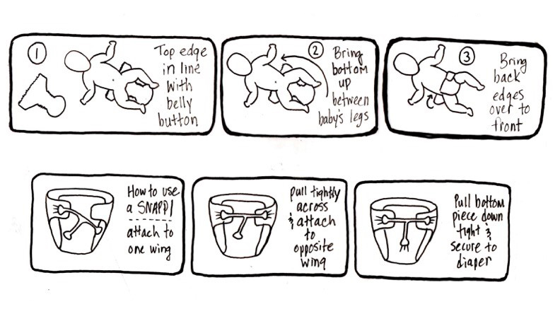

# Cleaning

## Home

- Swiffer solution: equal parts water and vinegar, 1-2 drops dish soap, couple
  drops of essential oil (from [here](https://helloglow.co/diy-swiffer-pads/))
- Shower cleaning spray: 1 part white vinegar or rubbing alcohol to 3 parts
  water, 5 drops essential oil (from
  [here](https://housewifehowtos.com/clean/homemade-daily-shower-spray-recipe/))
- Fruit fly trap: .25 cup apple cider vinegar with a few drops of liquid dish soap in a mason jar with plastic wrap with holes poked in it (from [here](https://www.thekitchn.com/apple-cider-vinegar-diy-fruit-fly-trap-23670359)).

## Baby

### Diapers

- Diaper wipe solution: most reddit threads recommend just using water in a
  spray bottle. One
  [comment](https://www.reddit.com/r/clothdiaps/comments/vqqh5k/wipe_solution/)
  suggested using a couple drops of oil to remove really sticky / partially
  dried ones as needed.
- Diaper cream: Mt Sinai video said no need to use cream for routine diaper
  changes, but if they get rash can use white zinc oxide cream (should be plant
  oil-based to make cleaning diaper easier). can make own by buying powder (up
  to 40% zinc oxide by weight), but apparently hard to clean if used in pot.
- Diaper pail (from [diaperkind](https://www.diaperkind.com/how-it-works/your-diaper-pail-and-bag/)):

    - can put Tbsp baking soda in bottom of pail for extra smell help
    - if pail smells while open, change the deo-disk (~4-6 weeks)
    - if pail smells while closed, change carbon filter (~3-4 weeks)
    - time between changes vary based on season, temperature, and humidity

- diaper basics (from [diaperkind](https://www.diaperkind.com/how-it-works/how-often-do-i-change-my-baby/)):

    - change baby with every feeding or whenever you detect poop
    - you do not need to wake a sleeping baby to change them
    - it's okay to leave a pee-diaper until next feeding

Diaper changing basics:

### Sleep

Baby sleep amounts, from [Precious Little Sleep](https://www.preciouslittlesleep.com/baby-sleep-what-is-normal/)

| Age                  | # Naps | Duration of Naps     | Time Between Naps          | Bedtime                                 | Hrs of Sleep @ Night | Total Hrs of Sleep per Day |
|----------------------|--------|----------------------|----------------------------|-----------------------------------------|----------------------|----------------------------|
| Birth  – 6 Weeks     | 4-8    | 15 minutes – 4 hours | 45 min – 1 hour            | Variable but often late 9:00 – 11:00 PM | 8-14                 | 14-18 hours                |
| 6  Weeks – 3 Months  | 3-4    | 30 minutes – 2 hours | 1 hour – 1 hour 45 minutes | Variable but often late 8:00 – 11:00 PM | 8-13                 | 11-15 hours                |
| 3 -6 Months          | 3      | 1-2 hours            | ~2 hours                   | 8:00 – 10:00 PM                         | 9-12                 | 12-14 hours                |
| 6 -9 Months          | 3      | 1-2 hours            | 2-3 hours                  | 8:00 – 10:00 PM                         | 9-12                 | 12-14 hours                |
| 9 -12 Months         | 2      | 1-2 hours            | ~3 hours                   | 7:00 – 8:00 PM                          | 10-12                | 12-14 hours                |
| 12 -18 Months        | 1-2    | 1-2 hours            | 3 hours                    | 7:00 – 8:00 PM                          | 10-12                | 12-14 hours                |
| 18  Months – 3 Years | 1      | 1-2 hours            | NA                         | 7:00 – 8:00 PM                          | 10-12                | 11-14 hours                |
