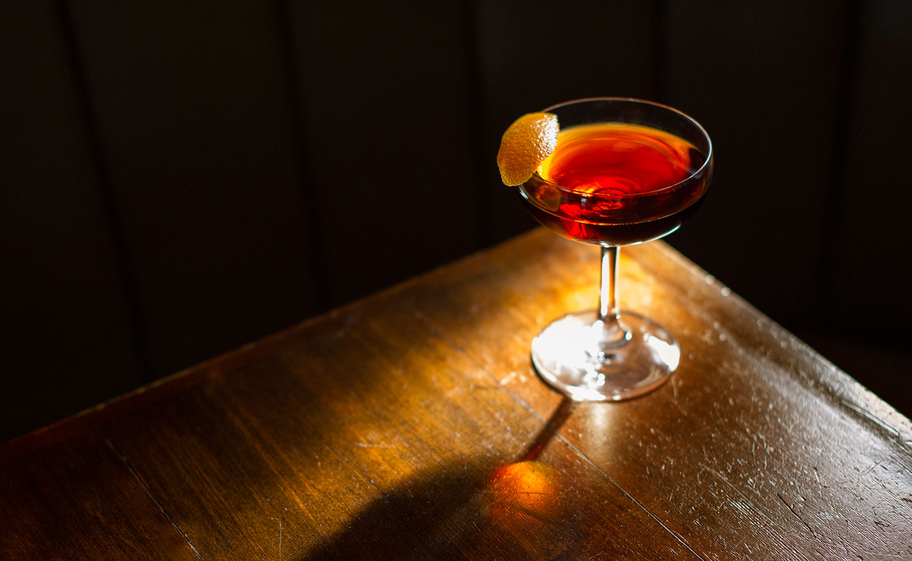

---
tags:
  - cocktail:stirred
  - ingredient:vermouth
  - ingredient:sherry
---
<!-- Tags can have colon, but no space around it -->

# Adonis

<!-- Serves has to be a single number, no dashes, but text is allowed after the
number (e.g., 24 cookies) -->
- Serves: 1
{ #serves }
- Date added: 2024-05-02

## Description

This cocktail recipe is a combination of sweet vermouth, dry sherry and bitters popularized in the 19th-century and revived by sherry-lovers.

## Summary 

<!-- put a brief summary of ingredients and ratios here, which will get summarized on index, e.g., for martini, 2:1 gin:vermouth -->

- 2:1 fino:sweet vermouth 
{ #summary }

## Ingredients { #ingredients }

- 2.0 ounces fino sherry 
- 1.0 ounce sweet vermouth 
- 2.0 dashes orange bitters (preferably Regans')

## Directions

<!-- If you have a direction that refers to a number of some ingredient, wrap
the number in asterisks and add `{.ingredient-num}` afterwards. For example,
write `Add 2 Tbsp oil to pan` as `Add *2*{.ingredient-num} to pan`. This allows
us to properly change the number when changing the serves value. -->

1. Add all ingredients to a mixing glass.
2. Add ice and stir until chilled.
3. Strain into a chilled coupe or cocktail glass.
4. Garnish with an orange peel.

## Source

[Punch](https://punchdrink.com/recipes/adonis/)

## Comments
