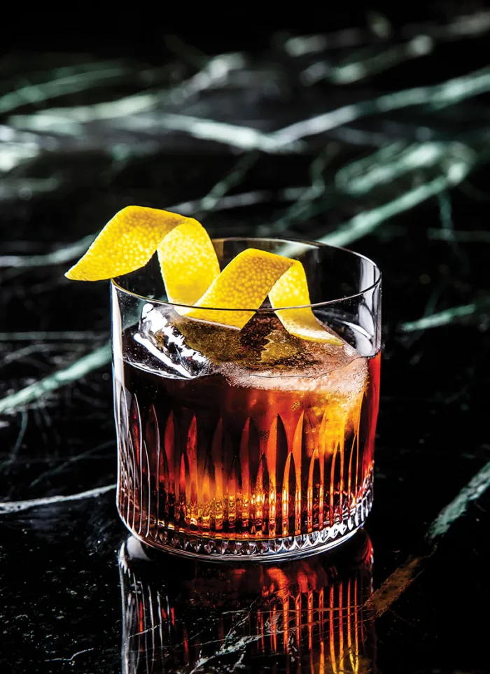

---
tags:
  - cocktail:stirred
  - ingredient:cynar
  - ingredient:vermouth
---
<!-- Tags can have colon, but no space around it -->

# Bitter Giuseppe

<!-- Serves has to be a single number, no dashes, but text is allowed after the
number (e.g., 24 cookies) -->
- Serves: 1
{ #serves }
- Date added: 2025-03-07

## Description

A cult favorite within the modern classic amaro cocktail canon, Stephen Cole’s Bitter Giuseppe, created at Chicago’s Violet Hour, uses Cynar as the foundation. The cocktail can be enjoyed as an aperitivo or an after-dinner digestivo and is one of several rule-breaking modern cocktails that gets stirred, rather than shaken, despite the inclusion of fresh lemon juice.

## Summary 

<!-- put a one-line summary of ingredients and ratios here, which will get summarized on index, e.g., for martini, 2:1 gin:vermouth -->

- 2:1:.25 cynar:sweet vermouth:lemon juice
{ #summary }

## Ingredients { #ingredients }

<!-- Decimals are allowed, fractions are not. For ranges, use only a single dash
and no spaces between the numbers. -->

- 2 ounces Cynar
- 1 ounce sweet vermouth, preferably Carpano Antica Formula
- .25 ounce lemon juice
- 6 dashes Regans' orange bitters
- Garnish: lemon twist

## Directions

<!-- If you have a direction that refers to a number of some ingredient, wrap
the number in asterisks and add `{.ingredient-num}` afterwards. For example,
write `Add 2 Tbsp oil to pan` as `Add *2*{.ingredient-num} to pan`. This allows
us to properly change the number when changing the serves value. -->

1. Combine all ingredients in a mixing glass filled with ice and stir until chilled.
2. Strain into a rocks glass over a large ice cube.
3. Garnish with a lemon twist.

## Source

[PUNCH](https://punchdrink.com/recipes/bitter-giuseppe/)

## Comments
