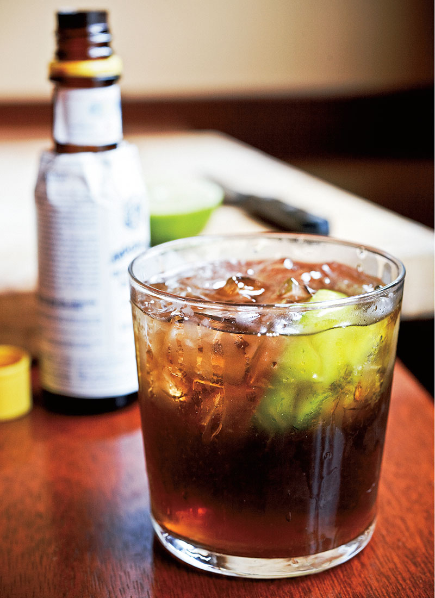

---
tags:
  - cocktail:tiki
  - ingredient:rum
  - ingredient:falernum
---
<!-- Tags can have colon, but no space around it -->

# Corn 'n' Oil

<!-- Serves has to be a single number, no dashes, but text is allowed after the
number (e.g., 24 cookies) -->
- Serves: 1
{ #serves }
- Date added: 2024-05-02

## Description

This drink is a classic combo of Caribbean flavors—the spice of falernum, bitters, lime and molasses-rich rum—making it similar to a Dark ’n’ Stormy, sans the spicy kick of ginger. The recipe varies depending on geographic preferences: American versions go heavy on rum, while the Barbadian blueprint specifies a heavier hand with the Velvet Falernum. Either way, we like lots of bitters per Brad Thomas Parsons’ recommendation in Bitters.

## Summary 

<!-- put a brief summary of ingredients and ratios here, which will get summarized on index, e.g., for martini, 2:1 gin:vermouth -->

- 2:.5:.5 dark rum:falernum:lime
{ #summary }

## Ingredients { #ingredients }

<!-- Decimals are allowed, fractions are not. For ranges, use only a single dash
and no spaces between the numbers. -->

- 2 ounces aged Barbados rum or blackstrap rum
- .5 ounce Velvet Falernum
- .5 ounce lime juice
- 3 dashes Angostura bitters 

## Directions

<!-- If you have a direction that refers to a number of some ingredient, wrap
the number in asterisks and add `{.ingredient-num}` afterwards. For example,
write `Add 2 Tbsp oil to pan` as `Add *2*{.ingredient-num} to pan`. This allows
us to properly change the number when changing the serves value. -->

1. Add all ingredients to a rocks glass.
2. Add crushed or cracked ice and stir.
3. Garnish with a lime wedge.

## Source

[Punch](https://punchdrink.com/recipes/corn-n-oil/)

## Comments

- 2024-05-02: Lot of discussion in [this article](https://punchdrink.com/articles/what-is-blackstrap-rum-anyway/) on what blackstrap rum actually is. Turns out, it's unclear. I think I originally made this drink using Cruzan Blackstrap rum, try and experiment to see what works.
