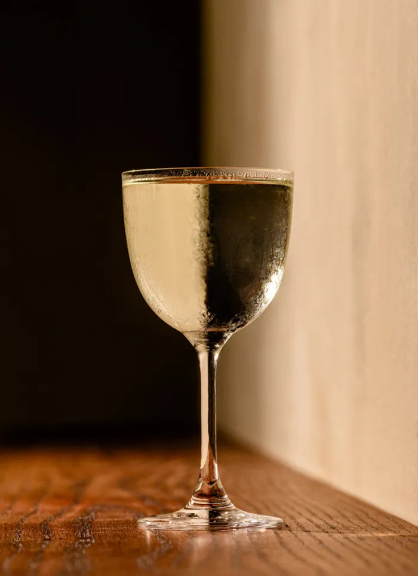

---
tags:
  - cocktail:stirred
  - ingredient:gin
  - ingredient:chartreuse
---
<!-- Tags can have colon, but no space around it -->

# Hedge Maze

<!-- Serves has to be a single number, no dashes, but text is allowed after the
number (e.g., 24 cookies) -->
- Serves: 1
{ #serves }
- Date added: 2025-03-04

## Description

“The fewer the elements, the better,” says Yanni Kehagiaras of his approach to cocktails at Stoa, one of our Best New Bars of 2024. At the San Francisco bar, the team strives to coax the most out of minimal builds. As Kehagiaras explains, he focuses “on micro quantities of potent spirits and liqueurs to make loud impact.” Here, a small measure of green Chartreuse boosts the herbal complexity found in the base of St. George Spirits Terroir Gin, which is lengthened by blanc vermouth for body and just the right amount of sweetness.

## Summary 

<!-- put a one-line summary of ingredients and ratios here, which will get summarized on index, e.g., for martini, 2:1 gin:vermouth -->

- 3:1:.5 gin:vermouth:chartreuse
{ #summary }

## Ingredients { #ingredients }

<!-- Decimals are allowed, fractions are not. For ranges, use only a single dash
and no spaces between the numbers. -->

- 1.5 ounces gin, preferably St. George Spirits Terroir Gin
- .5 ounce blanc vermouth, preferably Dolin
- .25 ounce green Chartreuse

## Directions

<!-- If you have a direction that refers to a number of some ingredient, wrap
the number in asterisks and add `{.ingredient-num}` afterwards. For example,
write `Add 2 Tbsp oil to pan` as `Add *2*{.ingredient-num} to pan`. This allows
us to properly change the number when changing the serves value. -->

1. Combine all ingredients in a mixing glass with ice and stir until chilled and diluted.
2. Strain into a chilled cocktail glass.

## Source

[Punch](https://punchdrink.com/recipes/hedge-maze/)

## Comments
