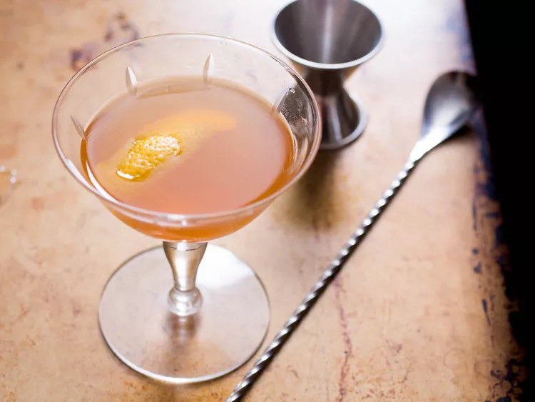

---
tags:
  - cocktail:tiki
  - ingredient:cognac
  - ingredient:orgeat
---
<!-- Tags can have colon, but no space around it -->

# Japanese cocktail

<!-- Serves has to be a single number, no dashes, but text is allowed after the
number (e.g., 24 cookies) -->
- Serves: 1
{ #serves }
- Date added: 2024-05-02

## Description

The Japanese Cocktail, curiously made with mostly French ingredients, is like an Old Fashioned with a rich and nutty twist. This classic cocktail included in Jerry Thomas' Bar-Tender's Guide in 1862. 

## Summary 

<!-- put a brief summary of ingredients and ratios here, which will get summarized on index, e.g., for martini, 2:1 gin:vermouth -->

- 2:.5 cognac:orgeat
{ #summary }

## Ingredients { #ingredients }

<!-- Decimals are allowed, fractions are not. For ranges, use only a single dash
and no spaces between the numbers. -->

- 2 ounces cognac
- .5 ounce orgeat
- 3 dashes Angostura bitters
- Lemon peel for garnish

## Directions

<!-- If you have a direction that refers to a number of some ingredient, wrap
the number in asterisks and add `{.ingredient-num}` afterwards. For example,
write `Add 2 Tbsp oil to pan` as `Add *2*{.ingredient-num} to pan`. This allows
us to properly change the number when changing the serves value. -->

## Source

[Serious Eats](https://www.seriouseats.com/japanese-cocktail-recipe)

## Comments
