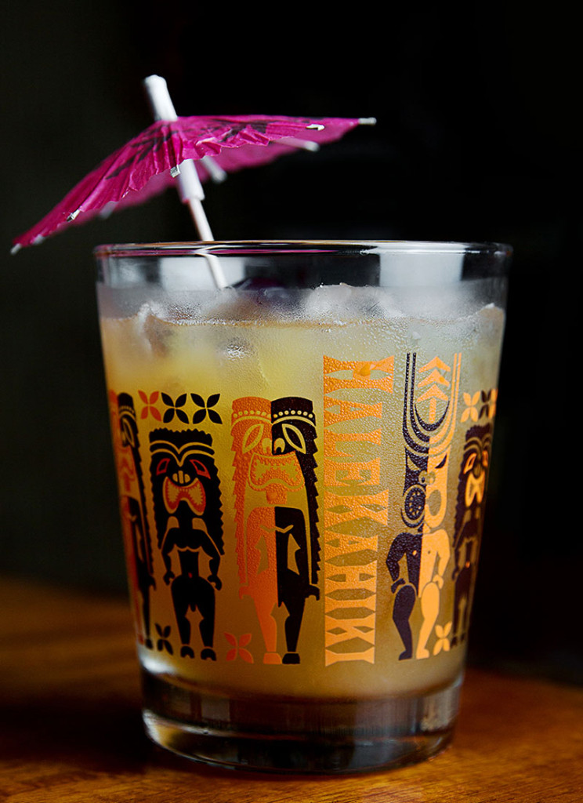

---
tags:
  - cocktail:tiki
  - ingredient:rum
  - ingredient:orgeat
  - ingredient:orange liqueur
---
<!-- Tags can have colon, but no space around it -->

# Mai Tai

<!-- Serves has to be a single number, no dashes, but text is allowed after the
number (e.g., 24 cookies) -->
- Serves: 1
{ #serves }
- Date added: 2024-05-02

## Description

The credit for this iconic 1940s drink—whose name is a nod to the Tahitian, “Maita’i,” which means “good”—is usually given to venerable Los Angeles tiki bar Trader Vic’s. Buoyed by the rise of tiki culture and some big celebrity endorsements (think Elvis in Blue Hawaii), this rum-based umbrella drink became cemented in the public imagination as a tropical must-have. The classic components of tiki are all here: lots of rum, a citrus component and a hint of exotica via the addition of orgeat, a syrup made from almonds. But don’t look to this drink for kitsch factor alone: when done up right—no orange juice or syrupy prefab Mai Tai mix—this is one of the greats. This version—a recipe interpreted by tiki bartender Brian Miller—is based on Trader Vic’s 1944 original. (It’s pictured in a Mai Tai glass from Alan Smart’s Los Angeles home tiki bar, HaleKahiki.)

## Summary 

<!-- put a brief summary of ingredients and ratios here, which will get summarized on index, e.g., for martini, 2:1 gin:vermouth -->

- 2:1:.75:.5 rum:lime:orgeat:curacao
{ #summary }

## Ingredients { #ingredients }

<!-- Decimals are allowed, fractions are not. For ranges, use only a single dash
and no spaces between the numbers. -->
- .5 ounce white rum, agricole (preferably Neisson L’Esprit rhum)
- .5 ounce gold rum (preferably Hamilton Jamaican gold)
- .5 ounce aged rum (preferably El Dorado 15 year)
- .5 ounce aged rum (preferably Appleton 12yr rum or Plantation Jamaica 2001)
- .5 ounce Clement Creole Shrubb (or an orange curaçao like Pierre Ferrand Dry Curaçao)
- 1 ounce lime juice
- .75 ounce orgeat (preferably Orgeat Works or Small Hand Foods) 

## Directions

<!-- If you have a direction that refers to a number of some ingredient, wrap
the number in asterisks and add `{.ingredient-num}` afterwards. For example,
write `Add 2 Tbsp oil to pan` as `Add *2*{.ingredient-num} to pan`. This allows
us to properly change the number when changing the serves value. -->

1. Add all ingredients to a cocktail shaker.
2. Add ice and shake until chilled.
3. Strain over crushed ice into a rocks glass.
4. Garnish with an umbrella, a lime wheel or spent lime shell and a sprig of mint (optional).

## Source

[Punch](https://punchdrink.com/recipes/mai-tai/)

## Comments

- 2024-05-02: looking at other variants of this, they always call for 2 oz of rum, typically dark, so could play around with that. [This article](https://www.seriouseats.com/tiki-cocktail-history-basics-of-tiki-drinks-essential-ingredients) says the original Mai Tai calls for 17-year Wray & Nephew rum, which is no longer available, and says that Jeff Beachbum Berry suggests a blend of Rhum Clement VSOP Martinique rum and Appleton Estate Extra 12-year-old dark Jamaican rum.
