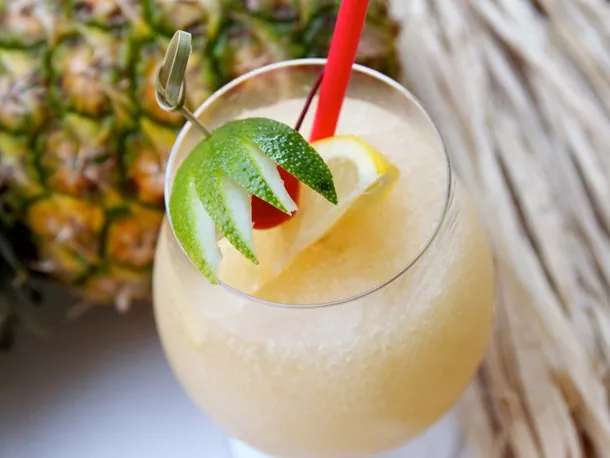

---
tags:
  - cocktail:tiki
  - cocktail:blended
  - ingredient:rum
  - ingredient:brandy
  - ingredient:orgeat
---
<!-- Tags can have colon, but no space around it -->

# Scorpion

<!-- Serves has to be a single number, no dashes, but text is allowed after the
number (e.g., 24 cookies) -->
- Serves: 1
{ #serves }
- Date added: 2024-05-02

## Description

This individually-sized Scorpion was adapted by Jeff Berry and Annene Kaye for Beachbum Berry's Grog Log based on an original drink by Trader Vic from the 1950s. We can't get enough: it's tart and fresh, lightly sweet, and nicely spiked with a mixture of light Puerto Rican rum and brandy. Have fun with the garnishes: throw on the edible flowers, pineapple wedges, cherries, limes, lemons...or make a huge batch and serve it in a Scorpion or flaming Volcano bowl with lots of straws. 

## Summary 

<!-- put a brief summary of ingredients and ratios here, which will get summarized on index, e.g., for martini, 2:1 gin:vermouth -->

- orange, lemon, orgeat, rum, brandy, blended
{ #summary }

## Ingredients { #ingredients }

<!-- Decimals are allowed, fractions are not. For ranges, use only a single dash
and no spaces between the numbers. -->

- 2 ounces fresh orange juice
- 1.5 ounces fresh lemon juice
- .5 ounce orgeat syrup
- 2 ounces light Puerto Rican rum
- 1 ounce brandy
- 1 cup crushed ice

## Directions

<!-- If you have a direction that refers to a number of some ingredient, wrap
the number in asterisks and add `{.ingredient-num}` afterwards. For example,
write `Add 2 Tbsp oil to pan` as `Add *2*{.ingredient-num} to pan`. This allows
us to properly change the number when changing the serves value. -->
1. Put all ingredients in a blender and blend for 10 seconds. Pour unstrained into a double old fashioned glass or wide brandy snifter. Garnish as desired. 

## Source

[Serious Eats](https://www.seriouseats.com/scorpion-rum-brandy-tiki-drink-recipe)

## Comments
