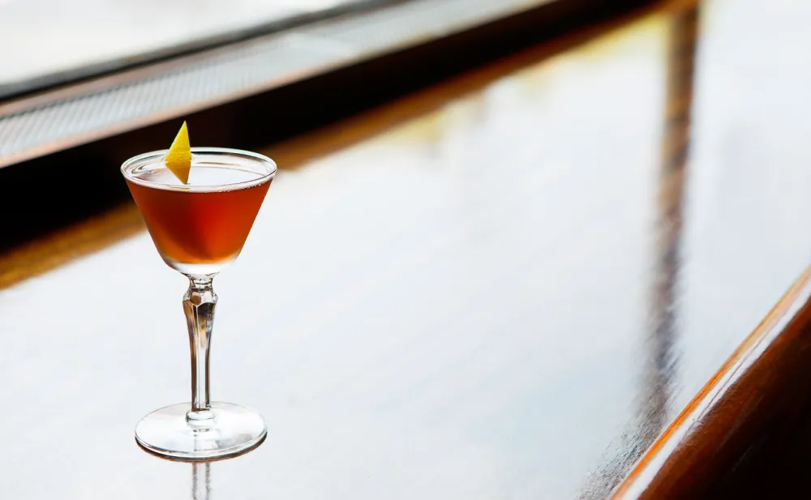

---
tags:
  - cocktail:stirred
  - ingredient:whiskey
  - ingredient:vermouth
  - ingredient:sherry
---
<!-- Tags can have colon, but no space around it -->

# Session Manhattan

<!-- Serves has to be a single number, no dashes, but text is allowed after the
number (e.g., 24 cookies) -->
- Serves: 1
{ #serves }
- Date added: 2025-03-11

## Description
In this low-proof spin on the Manhattan, sweet vermouth and rye switch places; the former acting as the base spirit and the latter as the modifier. Small measures of amontillado sherry and dry vermouth add complexity and balance.

## Summary 

<!-- put a one-line summary of ingredients and ratios here, which will get summarized on index, e.g., for martini, 2:1 gin:vermouth -->

- 1:.75:.75:.5 sweet vermouth:rye:amontillado:dry vermouth
{ #summary }

## Ingredients { #ingredients }

<!-- Decimals are allowed, fractions are not. For ranges, use only a single dash
and no spaces between the numbers. -->

- 1 ounce sweet vermouth
- .75 ounce rye whiskey
- .75 ounce amontillado sherry
- .5 ounce dry vermouth
- 2 dashes Angostura bitters 

## Directions

<!-- If you have a direction that refers to a number of some ingredient, wrap
the number in asterisks and add `{.ingredient-num}` afterwards. For example,
write `Add 2 Tbsp oil to pan` as `Add *2*{.ingredient-num} to pan`. This allows
us to properly change the number when changing the serves value. -->

1. Add all the ingredients in a mixing glass, add ice, and stir until chilled.
2. Strain into a coupe, then garnish with a lemon twist.

## Source

[PUNCH](https://punchdrink.com/recipes/session-manhattan/)

## Comments
