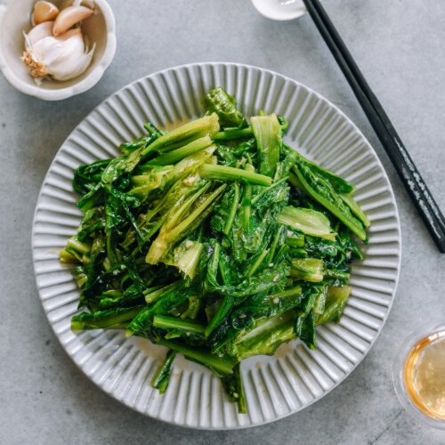

---
tags:
  - dish:sides
  - ingredient:greens
  - cuisine:chinese
  - difficulty:easy
---
<!-- Tags can have colon, but no space around it -->

# AA Choy with Garlic and Oyster Sauce

<!-- Serves has to be a single number, no dashes, but text is allowed after the
number (e.g., 24 cookies) -->
- Serves: 4
{ #serves }
<!-- Time is not parsed, so anything can be input here, and additional
values can be added (e.g., "active time", "cooking time", etc) -->
- Time: 30 minutes
- Date added: 2025-06-02

## Description
A Choy, or AA Choy, cooks up quickly, and the combination of garlic and oyster sauce never fails. Even your picky eaters will be helping themselves to more veggies! 

## Ingredients { #ingredients }

<!-- Decimals are allowed, fractions are not. For ranges, use only a single dash
and no spaces between the numbers. -->
- 1 pound AA choy 油麦菜, yóumài cài
- 3 tablespoons water
- 1 tablespoon oyster sauce (or vegetarian oyster sauce)
- .25 teaspoon salt
- .25 teaspoon white pepper
- 1 teaspoon sesame oil
- 3 tablespoons neutral oil (such as vegetable, peanut, or avocado oil)
- 4-5 cloves garlic (minced; about 2 tablespoons)
## Directions

<!-- If you have a direction that refers to a number of some ingredient, wrap
the number in asterisks and add `{.ingredient-num}` afterwards. For example,
write `Add 2 Tbsp oil to pan` as `Add *2*{.ingredient-num} to pan`. This allows
us to properly change the number when changing the serves value. -->
1. Remove the leaves from the center stem. Take the time to soak and wash them a few times. Shake off the excess water.
2. For the center stem, peel the skin and eat them as is (tossed with a little salt and sesame oil to make a nice salad), or slice them thinly and cook them along with the rest of the dish. Cut the long leaves into 3-inch (8cm) sections. Spin the leaves in a salad spinner until they’re nice and dry.
3. In a small bowl, mix the water, oyster sauce (or vegetarian oyster sauce), salt, white pepper, and sesame oil. Set aside.
4. Heat the wok over medium heat until it’s just starting to smoke. Add the oil and garlic. Let it cook for a few seconds, then immediately turn up the heat to high, and add the AA choy.
5. Stir the vegetables a few times. When the vegetables are about 50% wilted, add the prepared sauce. Mix everything well, and once the leaves have just started to wilt, turn off the heat. Serve immediately.

## Source

[Woks of Life](https://thewoksoflife.com/a-choy-garlic-oyster-sauce/)

## Comments
