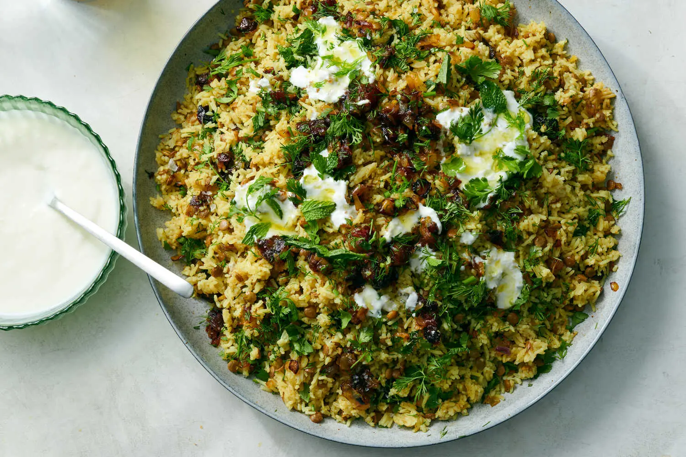

---
tags:
  - dish:main
  - protein:lentils
  - ingredient:rice
  - cuisine:iranian
---
<!-- Tags can have colon, but no space around it -->

# Adas Polo ba Khorma (Persian Lentil Rice With Dates)

<!-- Serves has to be a single number, no dashes, but text is allowed after the
number (e.g., 24 cookies) -->
- Serves: 6
{ #serves }
<!-- Time is not parsed, so anything can be input here, and additional
values can be added (e.g., "active time", "cooking time", etc) -->
- Time: 45 min
- Date added: 2025-04-01

## Description
Lentils and rice scented with warm spices and strewn with fried onions is a classic Persian dish with infinite variations. This minimalist take, from Nasim Alikhani, the owner of Sofreh restaurant in Prospect Heights, Brooklyn, keeps things quick and simple, and uses just a few pantry-friendly ingredients. The lentils and rice are cooked together in the same pot, then layered with a mixture of caramelized onions and plump, sweet dates, as well as chopped fresh herbs for brightness. A dollop of yogurt on top adds a tart and creamy touch. Feel free to riff on this basic recipe, adding nuts for crunch, stirring in other spices like cardamom, ginger and saffron, and substituting the likes of raisins, dried apricots or dried cranberries for the dates. At Sofreh, the dish is finished with a dash of rosewater and melted butter for extra richness and perfume.

## Ingredients { #ingredients }

<!-- Decimals are allowed, fractions are not. For ranges, use only a single dash
and no spaces between the numbers. -->
### For the Rice
- 1 cup green lentils, rinsed
- 2 tablespoons ground cinnamon
- .5 teaspoon ground turmeric
- 2 tablespoons plus 1 teaspoon kosher salt (such as Diamond Crystal), more as needed
- 2.5 cups basmati rice, rinsed and drained
- 1 cup chopped fresh herbs, such as cilantro, dill, mint or a combination
- 1 cup plain whole-milk yogurt, for serving (optional)
### For the Onion-date Mixture
- 6 tablespoons extra-virgin olive oil or clarified butter, plus more for serving (see Notes)
- 2 yellow onions, finely diced
- 12 fresh Medjool dates, pitted and diced

## Directions

<!-- If you have a direction that refers to a number of some ingredient, wrap
the number in asterisks and add `{.ingredient-num}` afterwards. For example,
write `Add 2 Tbsp oil to pan` as `Add *2*{.ingredient-num} to pan`. This allows
us to properly change the number when changing the serves value. -->
1. Bring 4 cups water to boil in a medium saucepan over high heat. Add the lentils, cinnamon, turmeric and 2 tablespoons salt. Stir well to combine, breaking up any clumps. Cover and reduce heat to medium. Simmer until the lentils are cooked but still have a bite, 7 to 10 minutes. Drain lentils and set aside.
2. Using the same medium saucepan, bring 2 cups water to a boil. Add the rice, cooked lentils, 1 teaspoon salt and enough hot water to cover the rice by 1 inch. Cook, uncovered, until all the water is absorbed, 10 to 14 minutes.
3. Reduce heat to low, wrap the pot lid in a clean kitchen towel, cover the pan and let the rice steam for 10 minutes. Fluff rice with a fork; taste and add salt if needed.
4. While the rice is cooking, prepare the onion-date mixture: In a skillet, heat 4 tablespoons oil or clarified butter until hot but not smoking. Add onions and a pinch of salt, and cook until the onions are dark golden and a little crispy, 9 to 14 minutes. Transfer onions to a bowl and return the skillet to the heat.
5. Add remaining 2 tablespoons oil to the skillet and, once hot, add the dates and warm them through, 1 to 2 minutes. Stir dates into the bowl with the onions.
6. To serve, spoon a layer of rice and lentils into a warmed serving bowl, then add a layer of onion-date mixture and sprinkle with chopped herbs. Keep alternating layers, ending with the onion-date mixture and a final sprinkling of herbs. Drizzle with more oil and top with a dollop of yogurt if you like.

## Notes
If you don't have clarified butter but would like a buttery flavor, you can use 2 tablespoons unsalted butter to warm the dates, and then top the dish with more melted butter. Be sure to use olive oil (or clarified butter) for the onions or they might burn.

## Source

[NYTimes](https://cooking.nytimes.com/recipes/1025151-adas-polo-ba-khorma-persian-lentil-rice-with-dates)

## Comments
