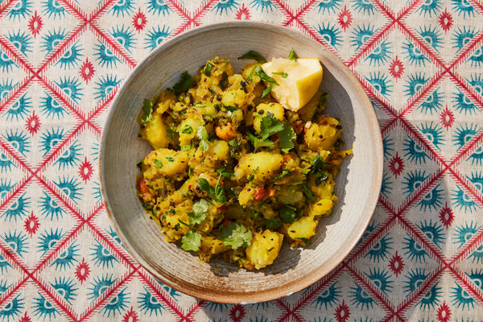

---
tags:
  - dish:sides
  - ingredient:potato
  - cuisine:indian
---
# Aloo masala

- Serves: 4
{ #serves }
- Time: 25 minutes

## Description

A little bowl of simply spiced half-mashed potatoes and onion, glistening with fat, is a standard side dish at bustling restaurants that serve dosas. It’s also one of the best vegetable dishes — inexpensive, quick and delicious — to add to your repertoire as a home cook. The key to these potatoes is water, not fat. Overcooking them just slightly ensures that they’re tender, and that they hold enough moisture so when you drop them into the hot pan, they break up and meld into the sautéed onion mix, becoming almost indistinguishable from it. Though aloo masala is great with a hot dosa, it’s a versatile dish that can also work as a side with other meals.

## Ingredients { #ingredients }

- 2 large Yukon Gold potatoes, peeled and cut into 1-inch cubes (about 4 cups)
- 2 tablespoons neutral oil, such as grapeseed or canola
- 1 tablespoon urad dal (split black gram)
- .5 teaspoon cumin seeds
- .25 teaspoon black mustard seeds
- 2 tablespoons roughly chopped roasted cashews
- 1 green finger chile (or serrano chile), finely chopped
- 1 (1-inch) piece fresh ginger, peeled and finely chopped
- 1 medium yellow onion, chopped
- .5 teaspoon kosher salt, plus more as needed
- .25 teaspoon ground turmeric
- .25 cup chopped cilantro leaves and tender stems
- 5 lemon, for squeezing

## Directions

1. Bring a pot of water to boil over high. Once the water boils, add the potatoes. Cook until tender, about 10 minutes, then drain in a colander.
2. In a heavy pot, heat the oil over medium. Add the urad dal, cumin and mustard seeds, and fry until cumin seeds are browned and dal is crisp, 1 to 2 minutes. Stir in the cashews, chile and ginger, and cook for another 2 minutes. Add the onion, salt and turmeric, and lower the heat. Cook, stirring occasionally, until the onion is translucent and tender but not browned, about 5 minutes.
3. Tip the cooked potatoes, half the cilantro and *.25*{.ingredient-num} cup water into the pot, and stir well to coat. As you stir, let some of the potato get mashed. If the mixture seems dry, add a splash more of water. Cook over low, stirring occasionally, until the potatoes are heated through, about 5 minutes, then season to taste with salt. Scrape into a serving dish; top with a generous squeeze of lemon and the remaining cilantro.

## Source

[NYTimes](https://cooking.nytimes.com/recipes/1020910-aloo-masala-spiced-potatoes)

## Comments
