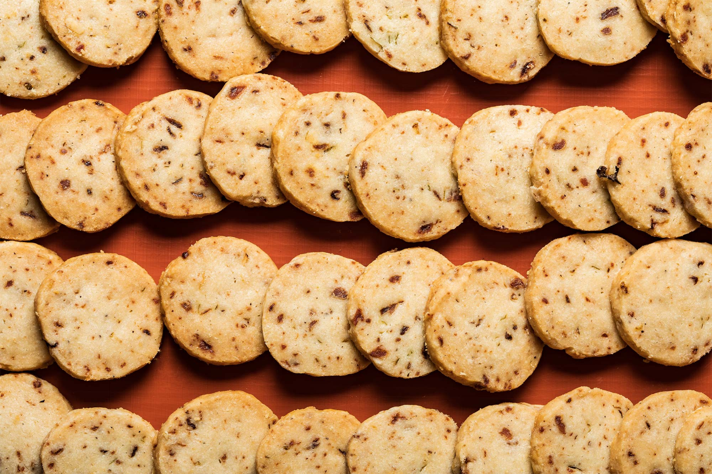

---
tags:
  - dish:baking
---
# Anchovy-Scallion Cookies

- Serves: 24 cookies
{ #serves }

## Description

When creating her lineup of savory cookies for The Rounds, her Brooklyn-based online bakery, Anna Harrington found inspiration in the Swedish dish Janssons frestelse (Jansson’s temptation), an anchovy-and-potato casserole. Her anchovy scallion cookie uses Italian cured anchovies rather than Swedish sprats for the right balance of salinity and depth.

Note: I use salted butter because I only use one brand (Kate’s Homemade Butter), so I know the amount of salt in each stick. I think salt should be used in baking similarly to the way it’s used in cooking—that is, in layers or stages. This is also the reason I use both fine and flaked salt. If you do not want to or cannot use Kate’s, go ahead and use unsalted butter, but then add an extra .125 teaspoon of fine salt.

## Ingredients { #ingredients }

- 2.25 sticks salted butter (Harrington uses Kate's Homemade Butter), softened but still cool
- 2 c all-purpose flour
- .25 c drained, chopped, and smooshed anchovies (good-quality Italian anchovy fillets in oil)
- 2 tbsp finely chopped scallions
- .25 tsp fine salt
- .5 tsp flaked salt
- .25 tsp freshly ground pepper (not too coarse!)

## Directions

1. Preheat oven to 350 degrees.
2. Beat the butter in a stand mixer with the paddle attachment. Add salts, pepper, anchovies, and scallions. Mix until well combined; mixture will take on a grayish hue.
3. Add the flour and mix slowly until fully incorporated, and until dough cleans sides of bowl.
4. Divide dough into 2 patties and wrap each in parchment paper. Let rest in fridge for at least 1 hour before rolling out to bake. (Dough will last, wrapped and chilled in refrigerator, for up to 3 days.)
5. Roll out to .25-inch thickness and use a 1-inch round cutter to cut out the cookies. (Alternatively, form the dough into a log instead of a patty, refrigerate, and slice with a very sharp, warm knife.)
6. Bake at 350 degrees for 24 minutes, rotating pans halfway through. The cookies should be lightly golden.
7. Allow cookies to cool fully before eating. Store in an airtight container at room temperature for up to 10 days.

## Source

[Taste](https://www.tastecooking.com/recipes/anchovy-scallion-cookies/)

## Comments

Total comments: 0

