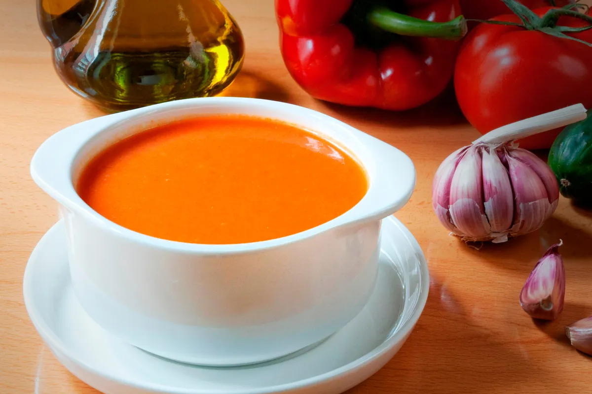

---
tags:
 - dish:soup
 - ingredient:tomato
 - context:summer vacation
 - difficulty:easy
---

# Andalusian-Style Gazpacho

- Serves: 1 
{ #serves }
- Working time: 0
- Waiting time: 0

## Description

## Ingredients { #ingredients }

- 1.0 pound vine tomatoes (don’t use beefsteak tomatoes, please)
- 2.0 medium-size cucumbers 
- 1.0 fresh green bell pepper 
- 1.0 small red onion 
- 2.0 cloves fresh garlic 
- 1.0 chunk stale bread (ideally French or Italian)
- A few generous glugs of olive oil (about a cup)
- 2.0 tablespoons red wine or sherry vinegar 
- Salt and pepper to taste 

## Directions

1. Soak the bread in water for five or ten minutes, then squeeze it out with your fist till it’s a soggy solid.
2. Chop up all the vegetables and the garlic. De-seed the cucumbers and tomatoes unless you like tomato seeds getting stuck in your teeth.
3. Put all of the above in your blender or food processor.
4. Add the liquid ingredients and spices.
5. Pulse until it turns a pale red, reminiscent of vodka sauce.
6. Chill till it feels cold to your finger.
7. Eat when it’s too hot to eat anything else.

## Source

[The Sword and the Sandwich](https://theswordandthesandwich.substack.com/p/summer-special-a-notable-soup)

## Comments
