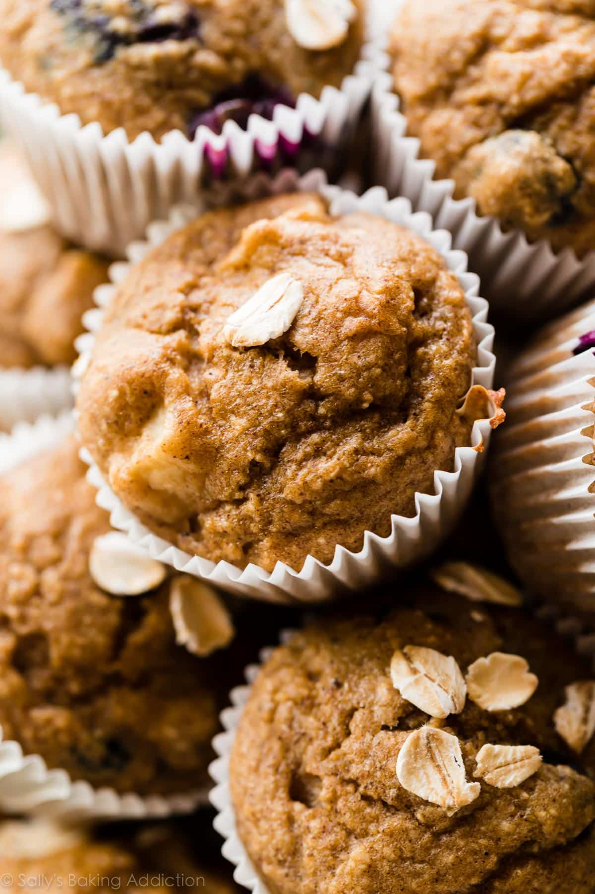

---
tags:
  - dish:baking
  - ingredient:oats
  - ingredient:banana
---
<!-- Tags can have colon, but no space around it -->

# Baby Apple Banana Oat Muffins

<!-- Serves has to be a single number, no dashes, but text is allowed after the
number (e.g., 24 cookies) -->
- Serves: 10 muffins
{ #serves }
<!-- Time is not parsed, so anything can be input here, and additional
values can be added (e.g., "active time", "cooking time", etc) -->
- Time: 1 hr
- Date added: 2025-12-13

## Description

Easy, quick, and healthy baby-friendly mini muffins made from banana, applesauce, and oats. Mixed in the blender and poured into muffin liners, this make-ahead recipe couldn’t be easier.

## Ingredients { #ingredients }

<!-- Decimals are allowed, fractions are not. For ranges, use only a single dash
and no spaces between the numbers. -->

- 1.25 cups (106g) old-fashioned whole rolled oats or quick oats, plus extra for topping
- 1 large ripe banana
- .33 cup (80g) unsweetened applesauce or fruit/veggie puree (see note)
- 1 large egg
- 2 or 3 Tablespoons coconut sugar, maple syrup, or other desired sugar*
- 1 teaspoon ground cinnamon
- 1.5 teaspoons baking powder
- .5 teaspoon baking soda
- .125 teaspoon salt
- .75 cup add-ins such as peeled diced apple, pear, or berries*

## Directions

<!-- If you have a direction that refers to a number of some ingredient, wrap
the number in asterisks and add `{.ingredient-num}` afterwards. For example,
write `Add 2 Tbsp oil to pan` as `Add *2*{.ingredient-num} to pan`. This allows
us to properly change the number when changing the serves value. -->

1. Preheat oven to 350°F (177°C). Spray a 24-count mini muffin pan with nonstick spray or use mini muffin liners. If using liners, grease the liners.
2. Place all of the ingredients in a blender or food processor, in the order listed, except for the 3/4 cup of add-ins. Blend or process until combined. Stir in the add-ins. Divide evenly between muffin liners. Top with a few oats, if desired.
3. Bake for 13-15 minutes or until a toothpick inserted in the center of a muffin comes out clean. Allow to cool for 10 minutes in the pan. Remove and cool completely before serving.
4. Muffins stay fresh covered at room temperature for up to 2 days or in the refrigerator for up to 1 week.

## Notes

<!-- Delete section if no additional notes -->

- Make Ahead Instructions: For longer storage, freeze muffins for up to 3 months. Allow to thaw on the counter or defrost in the microwave.
- Sugar: I usually prepare the muffins with 2 and 1/2 Tablespoons of coconut sugar.
- Applesauce or Puree: I usually make these with unsweetened applesauce or a baby/toddler food fruit puree. You can use yogurt instead, but the muffins won’t be as flavorful.
- Add Ins: I made the pictured muffins with finely diced apple and blueberries. Apples get nice and soft, but the blueberries can be a little messy with little self-feeding hands. Our daughter also enjoys them with diced strawberries.
- Muffin Liners: If using muffin liners, grease the liners or spray with nonstick spray. Warm muffins will stick otherwise. With the first batch I made, I didn’t grease the liners and they stuck. However, the muffins peeled out easily after refrigerating.
- Standard Size Muffins: Add 1/3 cup oats to the recipe, adding them to the blender with everything else. Spoon the batter into liners, filling them all the way to the top. Top with a few oats, if desired. Bake for 5 minutes at 425°F (218°C) then, keeping the muffins in the oven, reduce the oven temperature to 350°F (177°C). Bake for an additional 16-17 minutes or until a toothpick inserted in the center comes out clean. The total time the standard size muffins take in the oven is about 22-23 minutes, give or take.

## Source

[Sally's Baking](https://sallysbakingaddiction.com/baby-apple-banana-oat-muffins/)

## Comments
