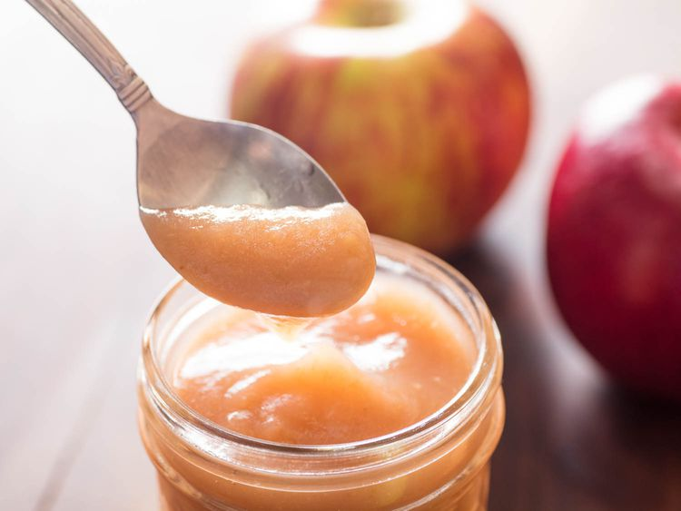

---
tags:
  - dish:sides
  - ingredient:apples
---
<!-- Tags can have colon, but no space around it -->

# Stella Parks's Applesauce

<!-- Serves has to be a single number, no dashes, but text is allowed after the
number (e.g., 24 cookies) -->
- Serves: 6 cups
{ #serves }
<!-- Time is not parsed, so anything can be input here, and additional
values can be added (e.g., "active time", "cooking time", etc) -->
- Time: 60 min
- Date added: 2024-12-15

## Description
Turning a trip to the orchard into a batch of applesauce is one of my favorite autumn rituals. The cozy aroma perfumes the entire house, drawing folks to the kitchen for stolen spoonfuls while the applesauce is still warm. It's simple, wholesome, and delicious—sweet enough to feel like dessert, but neither sugary nor cloying.
### Why it works
- The mellow sweetness of toasted sugar adds complexity.
- Apple cider vinegar helps brighten the cooked fruit.
- Using skin-on fruit improves both flavor and color in the finished product.
- Aromatics like cinnamon, orange peel, and rose water intensify the flavor of the apples.

## Ingredients { #ingredients }

<!-- Decimals are allowed, fractions are not. For ranges, use only a single dash
and no spaces between the numbers. -->

- 4 pounds mixed apples (about 12 medium apples; 1.8kg)
- 3.5 ounces plain or toasted sugar (about .5 cup; 100g)
- .5 teaspoon (2g) Diamond Crystal kosher salt; for table salt, use about half as much by volume or the same weight
- 1 ounce apple cider vinegar (about 2 tablespoons; 30g)
- 3-inch strip orange peel
- 3-inch cinnamon stick
- Apple cider, to adjust consistency
- .25 teaspoon rose water (optional)

## Directions

<!-- If you have a direction that refers to a number of some ingredient, wrap
the number in asterisks and add `{.ingredient-num}` afterwards. For example,
write `Add 2 Tbsp oil to pan` as `Add *2*{.ingredient-num} to pan`. This allows
us to properly change the number when changing the serves value. -->

1. Core apples without peeling, then slice and roughly chop into 1/2- to 1/4-inch pieces. This will yield approximately 3 1/2 pounds prepared fruit (16 cups; 1.5kg). Transfer to a 5-quart Dutch oven, along with sugar, salt, apple cider vinegar, orange peel, and cinnamon stick. Stir to combine, then cover and place over medium heat until apples have wilted and begun to bubble in their own juices, about 15 minutes. If this process seems to be moving slowly, simply turn up the heat.
2. Continue cooking, stirring from time to time, until apples are fall-apart tender, about 10 minutes more. Remove orange peel and cinnamon stick, then purée to your desired consistency with an immersion blender or food processor (see notes). If desired, thin as needed with apple cider to adjust consistency. For a more intense apple flavor, season with 1/4 teaspoon rose water.
3. Transfer applesauce to glass jars and refrigerate up to 3 weeks. If freezing, make certain not to overfill the containers, as the applesauce will expand once frozen. 
## Notes
- The texture of the finished applesauce depends entirely on how it's blended; for best results, use a high-powered immersion blender. I've had excellent results using the All-Clad stainless steel immersion blender. 
- Applesauce can be refrigerated up to 3 weeks or frozen. Just make sure if you're freezing to leave at least an inch of headroom, as the applesauce will expand once frozen. 
## Source
[Serious Eats](https://www.seriouseats.com/sweetened-spiced-applesauce-recipe)

## Comments
