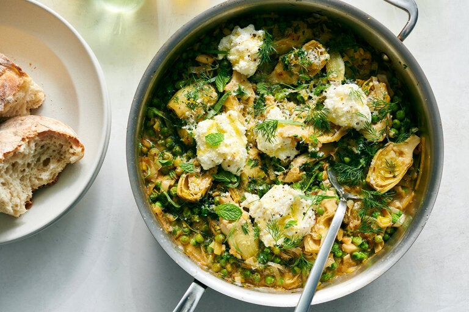

---
tags:
  - dish:main
  - ingredient:artichokes
  - ingredient:peas
  - difficulty:easy
---
<!-- Tags can have colon, but no space around it -->

# One-pan creamy artichokes and peas

<!-- Serves has to be a single number, no dashes, but text is allowed after the
number (e.g., 24 cookies) -->
- Serves:a 4
{ #serves }
<!-- Time is not parsed, so anything can be input here, and additional
values can be added (e.g., "active time", "cooking time", etc) -->
- Time: 30 minutes
- Date added: 2024-04-23

## Description

This creamy stew, full of seasoned sweet leeks, lemon zest and Parmesan, is a celebration of spring that you can make all year long, thanks to the canned artichokes and frozen peas. The creaminess comes from dolloping fresh ricotta over the top, then swirling it into the warm stew as you eat so it melts a little. Serve this with crusty bread or over pasta, gnocchi or rice to soak up the fragrant, herby pan sauce.

## Ingredients { #ingredients }

<!-- Decimals are allowed, fractions are not. For ranges, use only a single dash
and no spaces between the numbers. -->
- 3 tablespoons unsalted butter
- 2 leeks, white and light green parts, thinly sliced, or 1 bunch scallions, trimmed and sliced
- 2 fresh tarragon sprigs, more for serving
- .75 teaspoon fine sea or table salt, more to taste
- 2 tablespoons dry white wine or dry (white) vermouth
- 1 (14-ounce) can halved or quartered artichokes packed in water, drained
- 1.5 cups vegetable or chicken broth
- .25 cup grated Parmesan, more for serving
- 2 cups peas (10 ounces), fresh or frozen (no need to defrost)
- 1 teaspoon finely grated lemon zest
- 1 cup chopped combination fresh herbs (mint, dill, tarragon, parsley, cilantro)
- .5 cup whole-milk ricotta
- .5 teaspoon freshly ground black pepper

## Directions

<!-- If you have a direction that refers to a number of some ingredient, wrap
the number in asterisks and add `{.ingredient-num}` afterwards. For example,
write `Add 2 Tbsp oil to pan` as `Add *2*{.ingredient-num} to pan`. This allows
us to properly change the number when changing the serves value. -->
1. In a large skillet over medium heat, melt the butter. Stir in the leeks, tarragon and salt. Cook leeks until tender and golden brown at the edges, 4 to 6 minutes. Pour in the white wine and cook until evaporated, 2 to 3 minutes.
2. Stir in the artichokes, broth and Parmesan, and bring to a vigorous simmer. Cook until the leeks and artichokes are tender, about 5 minutes. Stir in the peas and cook until just tender and bright green, 1 to 3 minutes.
3. Stir in the lemon zest and fresh herbs. Taste and add more salt if needed. Top the skillet with dollops of ricotta, black pepper and more Parmesan. Serve warm.

## Source

[NYTimes](https://cooking.nytimes.com/recipes/1025231-one-pan-creamy-artichokes-and-peas)

## Comments
