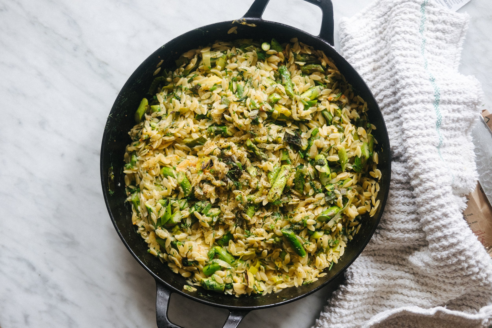

---
tags:
  - dish:main
  - ingredient:asparagus
  - ingredient:pasta
  - difficulty:easy
---
<!-- Tags can have colon, but no space around it -->

# One pot orzo with asparagus, lemon and dill

<!-- Serves has to be a single number, no dashes, but text is allowed after the
number (e.g., 24 cookies) -->
- Serves: 4
{ #serves }
<!-- Time is not parsed, so anything can be input here, and additional
values can be added (e.g., "active time", "cooking time", etc) -->
- Time: 30 min
- Date added: 2026-05-06

## Description
Here’s an easy one-pot pasta, with fresh pops of earthiness from asparagus and herbaceousness from a heavy use of dill. The asparagus could be subbed with roughly chopped spinach or Swiss chard, finely diced fennel, bok choy or small broccoli florets – any veg works, as long as it will cook quickly. Not a dill lover? Try another soft herb such as parsley, coriander/cilantro, or mint.

The addition of butter and miso adds a touch of indulgent umami, a hint of interest

## Ingredients { #ingredients }

<!-- Decimals are allowed, fractions are not. For ranges, use only a single dash
and no spaces between the numbers. -->
- 2 tablespoons extra virgin olive oil
- 1 leek or onion, trimmed and finely sliced
- 450g (1 pound) orzo (risoni) or other small pasta such as ditalini, farfalline
- 450g asparagus, woody ends removed and cut into 1.5cm (about ½-inch) pieces
- 1 liter (4.25 US cups) vegetable stock
- zest and juice of 1 lemon, or more to taste
- 2 tablespoons vegan or regular butter
- 1 tablespoon miso paste
- 1 bunch dill, leaves and stem finely chopped
- sea salt and black pepper

## Directions

<!-- If you have a direction that refers to a number of some ingredient, wrap
the number in asterisks and add `{.ingredient-num}` afterwards. For example,
write `Add 2 Tbsp oil to pan` as `Add *2*{.ingredient-num} to pan`. This allows
us to properly change the number when changing the serves value. -->
1. Heat a large, wide pan on medium-high heat. Add the olive oil and leek or onion and cook for 3-4 minutes until tender. Add the orzo (risoni) and stir to coat. Pour in the stock, stir and cover with lid. Cook for 6 minutes, reducing the heat to medium if it bubbles too aggressively, and then check the orzo - it should be slightly soft but not quite done, with still be quite a lot of liquid in the pan. Add the asparagus and drizzle it with olive oil, and a pinch of salt, cover again and cook for 2 minutes, until the asparagus is crisp tender and bright green and the pasta is fully cooked and al dente.
2. Uncover and add the zest and juice of the lemon, butter, miso paste, dill and stir to melt the butter and miso through the pasta. Taste and season well with sea salt and black pepper, adding more lemon juice if you like. Serve immediately.

## Source
[Hettie McKinnon](https://hettymckinnon.com/recipes/one-pot-orzo-with-asparagus-lemon-and-dill)

## Comments
