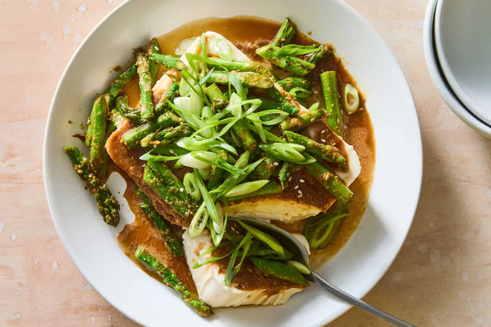

---
tags:
  - dish:main
  - protein:tofu
  - ingredient:asparagus
  - cuisine:japanese
---
<!-- Tags can have colon, but no space around it -->

# Asparagus Gomaae With Chilled Tofu

<!-- Serves has to be a single number, no dashes, but text is allowed after the
number (e.g., 24 cookies) -->
- Serves: 4
{ #serves }
<!-- Time is not parsed, so anything can be input here, and additional
values can be added (e.g., "active time", "cooking time", etc) -->
- Time: 20 min
- Date added: 2025-07-09

## Description
The classic Japanese side dish gomaae typically features blanched spinach coated in a sesame dressing, but here, the nutty sauce pairs beautifully with earthy asparagus. The asparagus is seared just briefly to unlock its buttery sweetness and juiciness; make sure the pan is hot when the asparagus makes contact to ensure the outside chars, even with a short cook time. The asparagus goma-ae is served atop chilled tofu, which serves as a creamy, refreshing backdrop for the bold umami of the sesame sauce. Eat this as a light meal, or partner it with rice or noodles.

## Ingredients { #ingredients }

<!-- Decimals are allowed, fractions are not. For ranges, use only a single dash
and no spaces between the numbers. -->
- .33 cup toasted white sesame seeds
- .25 cup tamari or soy sauce
- 2 tablespoons sugar
- 1 tablespoon rice vinegar
- 1 tablespoon vegetable or sunflower oil
- 1 pound asparagus, woody stems removed, cut into 1-inch pieces
- Salt and pepper
- 2 (14- to 16-ounce) packages silken tofu
- 2 scallions, thinly sliced
- Cooked rice or noodles (optional)

## Directions

<!-- If you have a direction that refers to a number of some ingredient, wrap
the number in asterisks and add `{.ingredient-num}` afterwards. For example,
write `Add 2 Tbsp oil to pan` as `Add *2*{.ingredient-num} to pan`. This allows
us to properly change the number when changing the serves value. -->
1. Make the goma sauce: Place the sesame seeds in a spice grinder, blender, small food processor or mortar, and grind or blend until coarsely ground, leaving lots of texture. Transfer the crushed sesame seeds to a medium bowl, add the tamari, sugar and vinegar, and mix to form a paste. Set aside.
2. Heat a large skillet over medium-high for 2 minutes. Drizzle with oil and add the asparagus. Season with salt and pepper, and toss until asparagus is bright green and just tender, 2 to 3 minutes. Transfer to another medium bowl and immediately add half of the sesame sauce. Toss to coat, then set aside to cool for 5 minutes.
3. Carefully drain the liquid from the packages of tofu and gently tip the blocks onto a kitchen towel. (Try to keep each block in one piece, if possible, but don’t worry if they fall apart.) Pat with another clean kitchen towel, removing as much liquid as possible. Transfer the blocks to one large rimmed plate (or shallow bowl) or two smaller ones — leave whole or cut into 1-inch blocks — and spoon over the remaining sesame sauce, dividing it evenly between the two blocks.
4. Top the tofu with the asparagus, ensuring it is evenly distributed. Top with scallions and serve with rice or noodles on the side, if using.

## Source

[NYTimes](https://cooking.nytimes.com/recipes/1026712-asparagus-gomaae-with-chilled-tofu)

## Comments

- 2025-07-09: made this with malabar spinach (blanched ~2 min, stems chopped) and this was delicious. the sauce is great.
