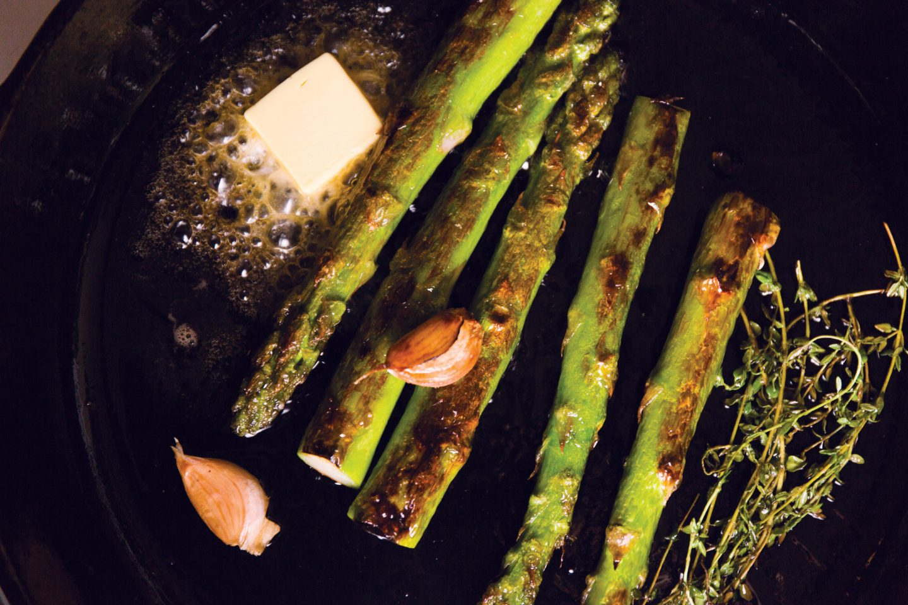

---
tags:
  - dish:sides
  - ingredient:asparagus
  - difficulty:easy,involved
---
<!-- Tags can have colon, but no space around it -->

# Asparagus like a steak

<!-- Serves has to be a single number, no dashes, but text is allowed after the
number (e.g., 24 cookies) -->
- Serves: 4
{ #serves }
<!-- Time is not parsed, so anything can be input here, and additional
values can be added (e.g., "active time", "cooking time", etc) -->
- Time: 10 min
- Date added: 2024-06-10

## Description

There is much talk in professional kitchens of learning how to cook meat, and while there is much to learn about the proper manipulation of flesh, the thing most people (in the European tradition) are talking about is this: browning it over high heat, mellowing it out, then basting it in an endless cascade of herb-scented butter until it’s at the appropriate level of doneness. There are few meats that don’t show well treated like that. And, frankly, it works on lots of vegetables too. The two I think of most often are carrots and asparagus, both of which take on color and play well with butter.

## Ingredients { #ingredients }

<!-- Decimals are allowed, fractions are not. For ranges, use only a single dash
and no spaces between the numbers. -->

- 2 Tbsp neutral oil
- 2 lb fat green or white asparagus spears
- 4 Tbsp unsalted butter, cut into 1 Tbsp pieces, chilled
- 4 garlic cloves
- 1 handful thyme sprigs
- flaky sea salt
- lemon wedges, for serving

## Directions

<!-- If you have a direction that refers to a number of some ingredient, wrap
the number in asterisks and add `{.ingredient-num}` afterwards. For example,
write `Add 2 Tbsp oil to pan` as `Add *2*{.ingredient-num} to pan`. This allows
us to properly change the number when changing the serves value. -->

1. Heat a large cast-iron skillet over high heat until a wisp of smoke rises from the surface. Add the oil, let it come to temperature for 30 seconds, then add about half the asparagus—there should be a spear’s width of free space between each piece.
2. Let the asparagus brown, cooking unmolested, 1 to 2 minutes. Shake the pan to roll them around, then add 2 tablespoons of the butter, 2 of the garlic cloves, and half the thyme. Tilt the pan toward you and use a large spoon to scoop the melting butter up and over the asparagus, basting it in hot fat. Baste the asparagus until they and the butter are nicely browned, about 2 minutes. Lift the asparagus from the pan and arrange on a warm platter. Pour over the browned butter, then wipe out the skillet and repeat with the remaining asparagus, butter, garlic, and thyme until you have filled a large platter.
3. Sprinkle the asparagus liberally with flaky sea salt and serve with lemon wedges.

## Source

[Lucky Peach](https://web.archive.org/web/20160919165041/https://luckypeach.com/recipes/asparagus-like-steak/)

## Comments
