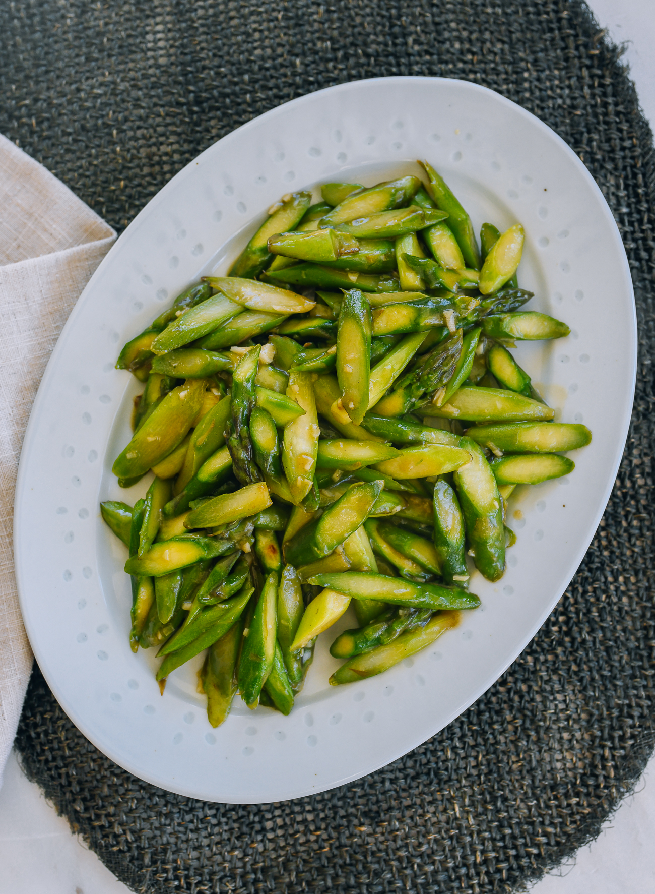

---
tags:
  - dish:sides
  - ingredient:asparagus
  - cuisine:chinese
  - difficulty:easy
---
<!-- Tags can have colon, but no space around it -->

# Asparagus stir-fry

<!-- Serves has to be a single number, no dashes, but text is allowed after the
number (e.g., 24 cookies) -->
- Serves: 4
{ #serves }
<!-- Time is not parsed, so anything can be input here, and additional
values can be added (e.g., "active time", "cooking time", etc) -->
- Time: 15 min
- Date added: 2024-05-08

## Description

A quick, delicious, and easy side dish, this asparagus stir-fry proves that your veggies don't have to be boring! 

## Ingredients { #ingredients }

<!-- Decimals are allowed, fractions are not. For ranges, use only a single dash
and no spaces between the numbers. -->

- .33 cup water or chicken stock
- 1 tablespoon Shaoxing wine
- 2 teaspoons oyster sauce (or vegetarian oyster sauce/GF oyster sauce if you have dietary restrictions)
- .25 teaspoon salt
- .25 teaspoon sugar
- .25 teaspoon sesame oil
- 1 pinch white pepper
- 2 tablespoons vegetable oil
- 1 pound asparagus (ends trimmed and peeled, cut at a sharp angle into 2-inch/5cm lengths)
- 3 cloves garlic (minced)
- 1 teaspoon cornstarch (mixed into a slurry with 1 tablespoon/15 ml water)

## Directions

<!-- If you have a direction that refers to a number of some ingredient, wrap
the number in asterisks and add `{.ingredient-num}` afterwards. For example,
write `Add 2 Tbsp oil to pan` as `Add *2*{.ingredient-num} to pan`. This allows
us to properly change the number when changing the serves value. -->
1. In a liquid measuring cup, combine the water (or chicken stock), Shaoxing wine, oyster sauce, salt, sugar, sesame oil, and white pepper.
2. In a wok over high heat, add the oil and the asparagus. Stir-fry for 1 minute, and then add the garlic and the sauce mixture you prepared earlier. Bring the mixture to a simmer, and cook for about 1 minute, until the asparagus is just tender.
3. Combine the cornstarch and water into a slurry, and pour it into the simmering sauce. Stir-fry until the vegetables are coated in sauce, with just a small amount of standing liquid. Serve.

## Source

[Woks of Life](https://thewoksoflife.com/asparagus-stir-fry/)

## Comments
