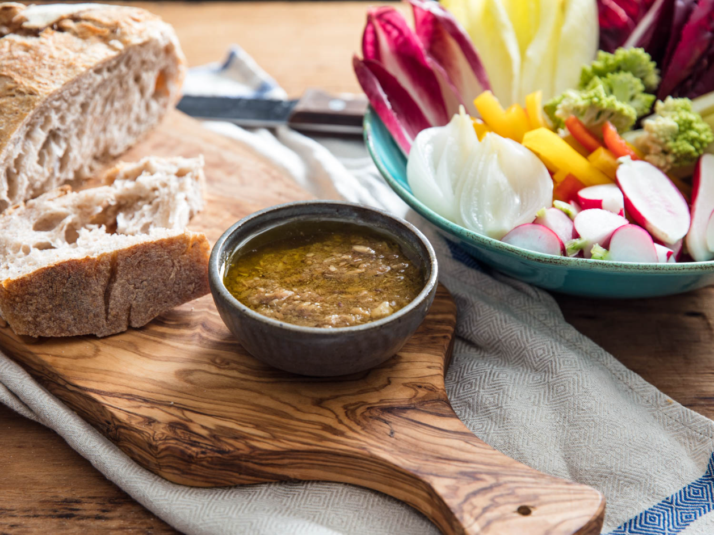

---
tags:
  - dish:pantry
  - cuisine:italian
  - context:holiday
  - context:entertaining
---
# Bagna Cauda

- Serves: 1
{ #serves }
- Time: 1 hour

## Description

A classic Piedmontese dish of warm olive oil loaded with garlic and anchovies.

## Ingredients { #ingredients }

- 1 head garlic, peeled (about 14 medium cloves; 60g once peeled)
- 1 cup (235ml) milk or water (see note)
- .5 cup (120ml) extra-virgin olive oil
- 100g high-quality oil-packed anchovy fillets (about 30 fillets)

### To serve
- Assorted raw vegetables, such as radishes, cauliflower florets, cardoon stalks (trimmed of long fibers), bell peppers, endive leaves, and more, cut for dipping
- 1 whole, skin-on yellow onion, roasted in a 400°F (200°C) oven until tender throughout, then peeled and cut for dipping (optional)

## Directions

1. Trim garlic cloves; if desired, halve lengthwise and remove germ from center. (Very developed green germs can add a subtle bitterness to the sauce, though our tests with younger garlic showed no noticeable difference between batches made with and without a more beige germ.) Slice garlic.
2. In a small saucepan, combine garlic and milk or water, bring to a gentle simmer, and cook until garlic is soft, about 10 minutes.
3. Drain garlic well. Wipe out saucepan, then return garlic to saucepan and cover with olive oil. Cook over very low heat until garlic is very soft and can easily be smashed with a wooden spoon, about 10 minutes.
4. Add anchovies and cook, stirring and smashing, until they have fully dissolved into the sauce. Continue smashing the garlic and anchovies until a thick purée forms. (If desired, you can very quickly purée the bagna càuda with an immersion blender to make an even smoother sauce.)
5. Serve hot with raw vegetables and slices of roasted onion (if using).

## Source

[Serious Eats]( https://www.seriouseats.com/recipes/2018/03/bagna-cauda-northern-italian-anchovy-garlic-dip.html)

## Comments
