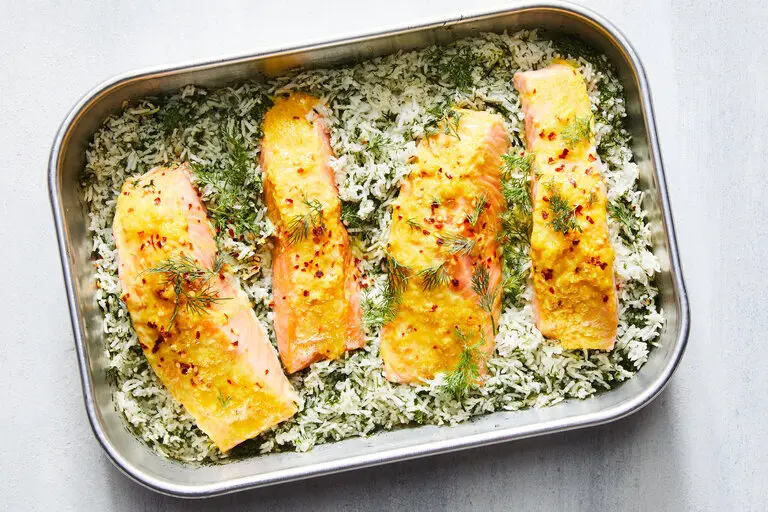

---
tags:
  - dish:main
  - protein:salmon
  - ingredient:rice
  - difficulty:easy
---
<!-- Tags can have colon, but no space around it -->

# Baked Salmon and Dill Rice

<!-- Serves has to be a single number, no dashes, but text is allowed after the
number (e.g., 24 cookies) -->
- Serves: 4
{ #serves }
<!-- Time is not parsed, so anything can be input here, and additional
values can be added (e.g., "active time", "cooking time", etc) -->
- Time: 40 min
- Date added: 2024-09-27

## Description
Fragrant dill rice is a natural accompaniment to salmon, and a complete meal of the two is made easy here by baking them together in one dish. Add fresh or dried dill to basmati rice, which is eventually topped with salmon covered in a tangy, sweet and spicy paste of mayo, lemon zest, honey and dried chile flakes. To ensure the rice is perfectly fluffy without overcooking the fish, the grains are baked until most of the water is absorbed before the salmon is added over the top.

## Ingredients { #ingredients }

<!-- Decimals are allowed, fractions are not. For ranges, use only a single dash
and no spaces between the numbers. -->
- 2 tablespoons extra-virgin olive oil
- 1.5 cups white basmati rice, rinsed and drained
- Kosher salt (such as Diamond Crystal) and black pepper
- 4 ounces fresh dill, tough stems removed and finely chopped (about 1 cup), or .33 cup dried, plus more for serving
- 2 large garlic cloves, finely grated
- 1 large lemon, zested (about 1 teaspoon)
- 1 tablespoon mayonnaise
- 1 tablespoon honey
- .25 teaspoon ground turmeric
- .25 teaspoon red-pepper flakes, plus more for serving
- 4 (six-ounce) salmon fillets (one-inch thick at their thickest parts), skin on or off

## Directions

<!-- If you have a direction that refers to a number of some ingredient, wrap
the number in asterisks and add `{.ingredient-num}` afterwards. For example,
write `Add 2 Tbsp oil to pan` as `Add *2*{.ingredient-num} to pan`. This allows
us to properly change the number when changing the serves value. -->
1. Place an oven rack in the center position and heat the oven to 400 degrees. In a kettle or a small saucepan, bring 2.75 water to a boil.
2. To a 9-by-13-inch baking pan, add the olive oil and spread it around the pan. Add the rice, *1*{.ingredient-num} teaspoon salt and the dill, and stir to combine. Spread the rice evenly across the pan. Add the boiling water, stir and cover tightly with foil. Place in the oven and bake until most of the water has been absorbed, 12 to 15 minutes.
3. Meanwhile, in a small bowl, combine the garlic, lemon zest, mayonnaise, honey, turmeric and red-pepper flakes. Season both sides of the salmon fillets well with salt (about *1.5*{.ingredient-num} teaspoons total) and pepper. Spread the mayonnaise paste on top (or flesh side) of the salmon fillets.
4. Remove the pan from the oven and very carefully lift the foil. Place the salmon fillets on top of the rice, paste side up, reseal and place back in the oven. Bake until the rice is fluffy and the salmon is tender, 15 to 20 minutes. Garnish with more fresh dill and red-pepper flakes.

## Source

[NYTimes](https://cooking.nytimes.com/recipes/1023910-baked-salmon-and-dill-rice)

## Comments

- 2024-09-27: made rice with broth and squeezed lemons over at the end. used 7 oz fresh dill and 1 Tbsp dried.
