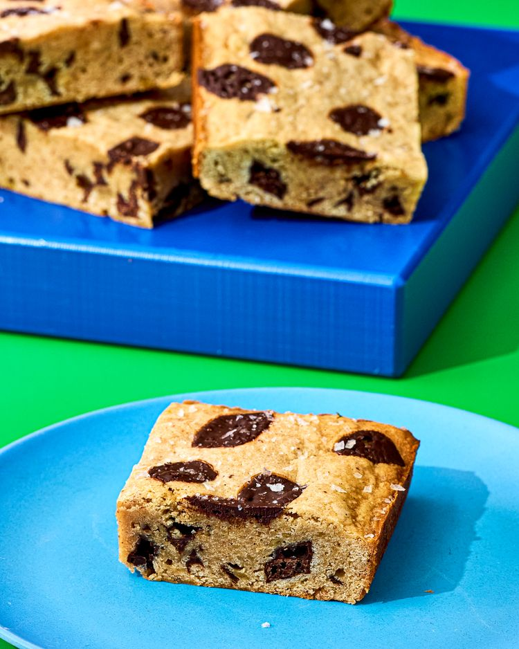

---
tags:
  - dish:dessert
  - ingredient:banan
---
<!-- Tags can have colon, but no space around it -->

# Banana bread blondies

<!-- Serves has to be a single number, no dashes, but text is allowed after the
number (e.g., 24 cookies) -->
- Serves: 12
{ #serves }
<!-- Time is not parsed, so anything can be input here, and additional
values can be added (e.g., "active time", "cooking time", etc) -->
- Time: 120 min
- Date added: 2025-09-07

## Description

Banana bread meets blondies in this chewy, chocolate-packed bar that's bold on flavor and easy to make.

What emerges from the oven is golden at the edges, fudgy in the middle, and fragrant with banana and spice. The chopped chocolate melts into pockets of richness, while a sprinkle of flaky salt on top sharpens each bite and keeps the sweetness in check. These blondies cut neatly into squares, but they're best enjoyed slightly warm and messy, with the chocolate smudging onto your fingers. Serve them for an afternoon snack, or dress them up with a scoop of vanilla or butter pecan ice cream for dessert. Part banana bread, part blondie, they're a hybrid that delivers the best of both worlds: comforting, chewy, and deeply satisfying.

## Ingredients { #ingredients }

<!-- Decimals are allowed, fractions are not. For ranges, use only a single dash
and no spaces between the numbers. -->

- Cooking spray
- 2 just-ripe bananas (about 11 ounces; 312 g), unpeeled
- 12 tablespoons (6 ounces; 170 g) unsalted butter, softened 
- 213 g packed light brown sugar (7 1/2 ounces; 1 cup)
- 99 g granulated sugar (3 1/2 ounces; 1/2 cup)
- 1 large egg
- 2 teaspoons (10 ml) vanilla extract
- 255 g all-purpose flour (9 ounces; 2 cups)
- 1 teaspoon Diamond Crystal kosher salt; for table salt, use half as much by volume or use the same weight
- 1 teaspoon ground cinnamon
- .25 teaspoon ground clove
- .25 teaspoon ground nutmeg
- 5 ounces (142 g) bittersweet chocolate, 60% cacao, chopped (about 1 cup), divided
- 2 teaspoons flaky sea salt (such as Maldon), optional

## Directions

<!-- If you have a direction that refers to a number of some ingredient, wrap
the number in asterisks and add `{.ingredient-num}` afterwards. For example,
write `Add 2 Tbsp oil to pan` as `Add *2*{.ingredient-num} to pan`. This allows
us to properly change the number when changing the serves value. -->

1. Adjust oven rack to middle position and preheat oven to 350°F (175°C). Grease and line a 9x9-inch baking pan with parchment paper, letting the parchment overhang on 2 sides by at least 1 inch. Line a rimmed baking sheet with parchment paper.
2. Place whole bananas still in their peels on prepared baking sheet. Bake until banana peels are darkened in color, about 15 minutes. Remove from oven and allow to slightly cool, about 5 minutes. Carefully peel bananas. In a medium bowl, mash bananas with a fork; set aside.
3. In a large bowl with a hand-held electric mixer, or in the bowl of a stand mixer fitted with the whisk attachment, beat butter, brown sugar, and granulated sugar on medium speed until fluffy and pale, 2 to 3 minutes. Add 1/2 cup (120 ml) mashed banana, egg, and vanilla and beat on medium-low speed until just combined, about 1 minute.
4. Stir in flour, salt, cinnamon, clove, and nutmeg until just combined. Using a flexible rubber spatula, fold in about 3/4 of chopped chocolate until just combined. Spread batter into prepared baking pan. Sprinkle with remaining 1/4 cup chocolate.
5. Bake until edges are set and golden brown and center springs backs lightly when lightly pressed, 25 to 28 minutes. Sprinkle with flaky salt, if using. Transfer pan to a wire rack to cool completely, about 1 hour before slicing. Serve. 

## Source

[Serious Eats](https://www.seriouseats.com/banana-bread-blondies-recipe-11799604)

## Comments

- 2025-09-07: delicious. made in the 8x10, but I think the center was undercooked, 
