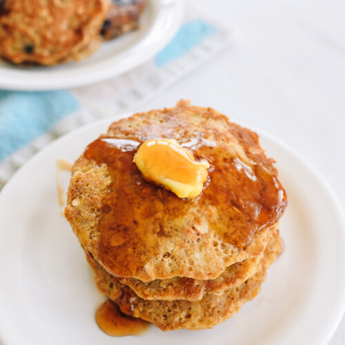

---
tags:
  - ingredient:banana
  - ingredient:oats
  - context:baby
  - difficulty:easy
---
<!-- Tags can have colon, but no space around it -->

# Banana Oat Pancakes

<!-- Serves has to be a single number, no dashes, but text is allowed after the
number (e.g., 24 cookies) -->
- Serves: 2
{ #serves }
<!-- Time is not parsed, so anything can be input here, and additional
values can be added (e.g., "active time", "cooking time", etc) -->
- Time: 15 min
- Date added: 2025-05-07

## Description

These easy banana oat pancakes are in permanent rotation in my house. They 15 minutes to make and freeze well for quick breakfasts & snacks!

## Ingredients { #ingredients }

<!-- Decimals are allowed, fractions are not. For ranges, use only a single dash
and no spaces between the numbers. -->
- 1 banana
- 1 egg
- .33 rolled or quick cooking oats
- .25 teaspoon vanilla extract
- .25 teaspoon cinnamon
- 1 tablespoon neutral oil
### Optional additions:
- 1 tablespoon flax seed meal
- 1 tablespoon peanut butter (or almond butter or other nut butter)
- .25 fresh or frozen fruit (such as blueberries, raspberries, chopped strawberries, or chopped mango)
## Directions

<!-- If you have a direction that refers to a number of some ingredient, wrap
the number in asterisks and add `{.ingredient-num}` afterwards. For example,
write `Add 2 Tbsp oil to pan` as `Add *2*{.ingredient-num} to pan`. This allows
us to properly change the number when changing the serves value. -->
1. In a medium bowl, mash the banana with a fork. Crack the egg into the bowl, and beat it together with the banana. Stir in the oats, vanilla, and cinnamon. At this point, you can stir in any add-ins, like flaxseed meal, nut butter, and fruit.
2. Thoroughly heat a pan over medium heat, and add the oil. Dollop the batter into the hot pan (I like to make small pancakes), and cook for a few minutes on each side, until golden brown. Enjoy!

## Source

[Woks of Life](https://thewoksoflife.com/banana-oat-pancakes/#recipe)

## Comments

- 2025-05-07: good, baby enjoys them. need to keep them small to make them flippable -- they fall apart pretty easily (seem to cook best in stainless steel frying pan). the riper the banana, the more liquidy they are, so less ripe is better.
