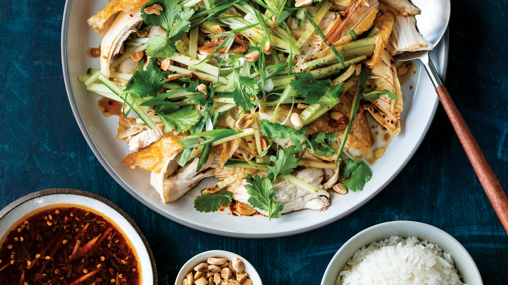

---
tags:
  - protein:chicken
  - dish:main
  - cuisine:chinese
---
# Bang Bang Crispy Chicken Breasts

- Serves: 3
{ #serves }
- Time: 
- Date added: 2023-08-26

## Description

Why bang on chicken? To quickly split the cooked meat into stringy shreds, allowing the sauce to work its way into all the nooks and crannies—and you’ll want that with this savory-sweet-sour, sizzling, chile oil–based sauce. Bang bang chicken is typically made with poached or steamed chicken breasts that are completely shredded afterward. Yes, you could use boneless, skinless chicken breasts as a substitute, but I’d first recommend any bone-in, skin-on chicken pieces, so you’ll get crispy skin as well as juicy meat and drippings to add to your sauce. Serve it with rice, or over a bed of cooked Asian wheat noodles, soba noodles, bean thread noodles, or shredded lettuce.

## Ingredients { #ingredients }
- 2 bone-in, skin-on chicken breasts
- 1 tbsp sesame oil
- 1 tsp salt
- .5 tsp white pepper
- 1 md cucumber, peeled and julienned
- .5 c roasted peanuts, roughly chopped (optional)
- 2 scallions, thinly sliced on a bias (both green and white parts)
- 1 c cilantro, both leaves and tender stems, roughly chopped

### For the sauce:
- 1 sm shallot, sliced as thinly as you can (use a mandoline if it helps)
- 1 lg clove garlic, sliced as thinly as you can (use a mandoline if it helps)
- 1-2 tbsp red chile flakes (1 for “medium” heat, 2 for “spicy” heat)
- .5 tsp salt
- .5 c neutral cooking oil
- .25 c soy sauce
- .25 c Chinese black vinegar, or substitute with red wine vinegar
- 2 tbsp sugar
- 1 inch piece ginger, julienned

## Directions

1. Preheat oven to 450°F. Rub the chicken breasts with the sesame oil, salt, and white pepper. Gently slide your finger underneath the skin to loosen it from the meat (this will encourage the skin to crisp). Place breasts on a sheet pan, skin side up. Roast 30 to 35 minutes, until the chicken skin is nicely crisped.
2. Combine the shallot, garlic, red chile flakes, and salt in a small heatproof bowl, such as a large Pyrex measuring cup, a small Pyrex mixing bowl, or a small saucepan.
3. Heat the oil in a saucepan over high heat for 2 to 3 minutes, until very hot and beginning to smoke. Carefully pour the hot oil over the chile flake mixture, standing away as it bubbles for several seconds.
4. In a separate bowl, combine the soy sauce, black vinegar, sugar, and julienned ginger. Add a couple tablespoons of the (slightly cooled) chile oil mixture, or as much as you prefer, to taste.
5. Transfer the sheet pan to a flat surface. Slowly press down on each chicken breast with a rolling pin, and roll along its length so the meat breaks and shreds apart a bit (be careful not to splatter the juice). If preferred, remove bones and discard. Scrape the pan to collect any browned bits and juices from the chicken, and add it to your sauce.
6. Place the banged-up chicken breasts in a large serving dish (if using a base of noodles or lettuce, add this to the bottom first). Scatter with the cucumber, then pour the sauce all over. Top with the chopped peanuts, scallions, and cilantro, and enjoy.

## Source

Sheet Pan Chicken, via [TASTE](https://www.tastecooking.com/recipes/bang-bang-crispy-chicken-breasts/)

## Comments
