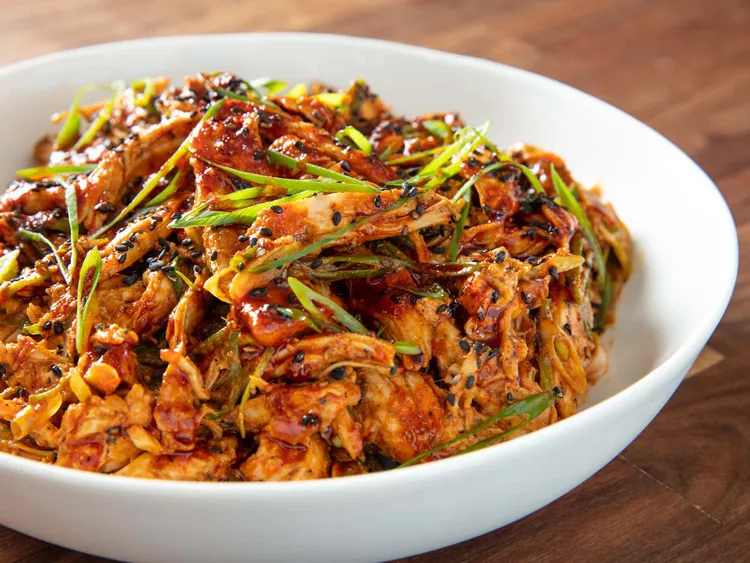

---
tags:
  - dish:main
  - protein:turkey
  - cuisine:chinese
  - context:holiday
---
<!-- Tags can have colon, but no space around it -->

# Hot and Numbing Sichuan-Style Turkey Salad

<!-- Serves has to be a single number, no dashes, but text is allowed after the
number (e.g., 24 cookies) -->
- Serves: 4
{ #serves }
<!-- Time is not parsed, so anything can be input here, and additional
values can be added (e.g., "active time", "cooking time", etc) -->
- Time: 10 min
- Date added: 2023-12-28

## Description

To make bang bang turkey, I mostly follow Kenji's method from his bang bang chicken recipe but did away with the sous vide poultry cooking (this version is for T-Day leftovers, after all), and start by pulling leftover turkey breast by hand into bite-sized pieces. While turkey breast is the closest equivalent for the poached white-meat chicken in the original dish, you certainly can use leftover dark meat here as well. 

The dressing is really the only bit of work for this recipe, and it comes together quickly with a mortar and pestle. For this version, I adjusted the ratios on the dressing slightly to make it a little more approachable for any houseguests you may be hosting for the holidays who aren't used to the numbing power of Sichuan pepper and the intense heat of sediment-rich chili oil.

Toss the turkey with the dressing and some thinly sliced scallions, and plate it up, sprinkling sesame seeds and more scallions over top before serving. If you are in the company of people with a higher tolerance for heat, you can drizzle a little extra chili oil over the whole deal right before serving. This is a dish that will jolt everyone out of their leftover lethargy and numb the pain of going back to work after the long holiday weekend.

### Why it works:
- The hot and numbing Sichuan-style dressing comes together in a minute with the help of a mortar and pestle.
- Adding stock (turkey or chicken) to the dressing helps combat the problem of dried-out leftover turkey meat.

## Ingredients { #ingredients }

<!-- Decimals are allowed, fractions are not. For ranges, use only a single dash
and no spaces between the numbers. -->

- 2 teaspoons (2g) whole Sichuan peppercorns, toasted
- 3 medium garlic cloves (15g)
- 1 (1/2-inch) knob peeled fresh ginger (5g)
- 1 tablespoon (15g) sugar
- 2 teaspoons (4g) black or white sesame seeds, plus more for garnish, toasted
- 2 tablespoons (30ml) Chinkiang or black vinegar
- 2 tablespoons (30ml) homemade turkey or chicken stock, or store-bought, low-sodium chicken stock, plus more as needed
- 2 tablespoons (30ml) white sesame paste, preferably Chinese, but tahini will do in a pinch
- 1 tablespoon (15ml) soy sauce
- .25 cup (60ml) chili oil with sediment (see notes)
- 1 pound (450g) leftover roast turkey breast, pulled
- 4 scallions (60g), thinly sliced on a sharp bias, divided
- Kosher salt

## Directions

<!-- If you have a direction that refers to a number of some ingredient, wrap
the number in asterisks and add `{.ingredient-num}` afterwards. For example,
write `Add 2 Tbsp oil to pan` as `Add *2*{.ingredient-num} to pan`. This allows
us to properly change the number when changing the serves value. -->

1. Using a mortar and pestle, grind Sichuan peppercorns into a coarse powder, about 30 seconds. Add garlic, ginger, sugar, and sesame seeds, and pound to a rough paste, about 1 minute. Add vinegar, stock, sesame paste, and soy sauce, and pound to a smooth paste, 15 to 30 seconds. Stir in chili oil and sediment.
2. In a medium bowl, toss turkey with dressing and 3/4 of scallions until turkey is well-coated, adding extra stock as needed if turkey is too dry. Season to taste with salt. Transfer turkey to a serving bowl or individual serving plates, sprinkle with remaining scallions, more toasted sesame seeds, and additional chili oil if desired. Serve immediately. 

## Notes

<!-- Delete section if no additional notes -->

Chili oil with sediment can be found in most Chinese supermarkets. Alternatively, make your own by toasting 1/4 cup (15g) of dried ground Sichuan or Thai chiles in a dry wok or saucepan until fragrant. Add 1/2 cup (120ml) of neutral oil like canola and heat until lightly bubbling. Immediately transfer to a cool heatproof container and let rest until cool. Chili oil can be stored in a sealed container in the refrigerator indefinitely. 

## Source

[Serious Eats](https://www.seriouseats.com/sichuan-bang-bang-turkey-salad)

## Comments
