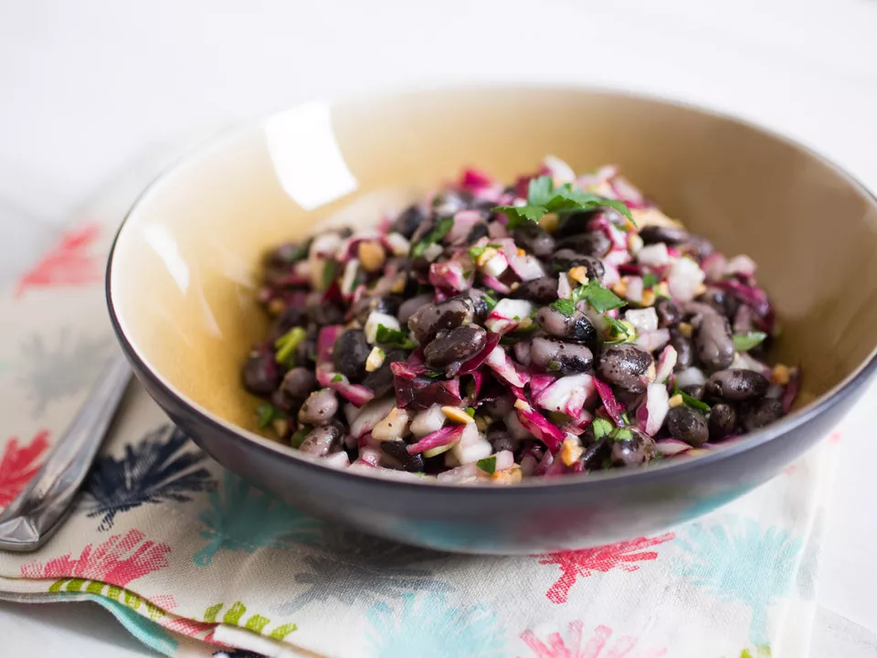

---
tags:
  - dish:main
  - protein:beans
---
# Bean salad with radicchio and pickled onions

- Serves: 4
{ #serves }
- Active time: 25 minutes
- Total time: 25 minutes

## Ingredients { #ingredients }

- .5 small red onion, finely chopped
- Red wine vinegar, for pickling
- .5 cup Marcona almonds
- 4 cups cooked drained beans (fresh or canned; see note), such as turtle, navy, and/or black-eyed peas
- 3 radishes, finely diced
- 2 scallions, white and light green parts only, chopped
- 1 (6-ounce) head radicchio, quartered, cored, and roughly chopped
- .5 cup chopped fresh parsley (from 1 bunch)
- Simple Vinaigrette, for dressing
- Kosher salt and freshly ground black pepper

## Directions

1. In a small bowl, add onion and pour enough vinegar over it to just cover. Let stand 15 minutes.
2. Place almonds in a zipper-lock plastic bag, push out air, and seal. Using a skillet, smash almonds until roughly crushed.
3. Drain onions. In a large bowl, combine marinated onions, smashed almonds, beans, radishes, scallions, radicchio, and parsley. Drizzle with vinaigrette, tossing, until ingredients are lightly coated. Season with salt and pepper. Serve. Salad can be refrigerated up to 3 days.

## Notes

If using dried beans, .75 pound dried will yield approximately 4 cups cooked. If using canned, 3 (15-ounce) cans should provide the 4 cups cooked beans called for here. Read more on dried-to-cooked/canned bean conversions [here](https://www.seriouseats.com/is-there-a-ratio-for-converting-between-dried). To cook dried beans, soak overnight (or, if you're short on time, bring to a boil in a pot of water), then drain. Add plenty of fresh cold water to cover, along with aromatics like onion, garlic, and carrots, and season with salt; bring to a simmer and cook until beans are tender. 

## Source

[Serious Eats](https://www.seriouseats.com/bean-salad-radicchio-radish-almond-recipe)

## Comments
