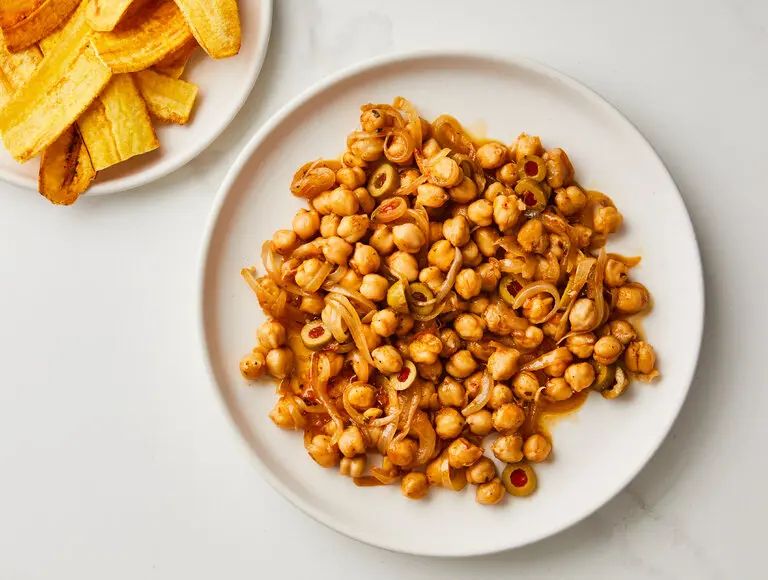

---
tags:
  - dish:main
  - protein:beans
---
<!-- Tags can have colon, but no space around it -->

# Beans en escabeche

<!-- Serves has to be a single number, no dashes, but text is allowed after the
number (e.g., 24 cookies) -->
- Serves: 4
{ #serves }
<!-- Time is not parsed, so anything can be input here, and additional
values can be added (e.g., "active time", "cooking time", etc) -->
- Time: 30 min
- Date added: 2024-05-08

## Description
In the Spanish-speaking world, the technique of cooking ingredients and then immersing them in vinegar is called escabeche. Anything can be made escabeche; it brings a lovely little shiver of sourness to the table. The writer and cultural critic Alicia Kennedy, who lives in Puerto Rico, likes to use chickpeas, simmering them in vinegar, olive oil and sofrito, a potent blend of garlic, onions, sweet peppers, grassy-bright cilantro and its swaggering cousin culantro. Just before serving, she adds Spanish stuffed olives, for extra richness. The beans are meaty enough to sate and small enough to scoop up with a chip — or, as Ms. Kennedy prefers, to be spooned, almost daintily (‘‘like caviar,’’ she says), onto a delicate strip of crisped plantain, hot from the skillet.

## Ingredients { #ingredients }

<!-- Decimals are allowed, fractions are not. For ranges, use only a single dash
and no spaces between the numbers. -->
### For the Chickpeas
- .25 olive oil
- 3 tablespoons store-bought or homemade sofrito 
- 1 small yellow onion, thinly sliced
- Salt, to taste
- 1 (15-ounce) can chickpeas (garbanzo beans), drained
- .25 cup white vinegar
- Spanish stuffed olives, sliced if large, to taste and to finish 

### For the Plantain Strips (optional)
- 1 to 2 green (unripe) plantains (about 6 ounces each)
- About 2 cups coconut or vegetable oil, for frying
## Directions

<!-- If you have a direction that refers to a number of some ingredient, wrap
the number in asterisks and add `{.ingredient-num}` afterwards. For example,
write `Add 2 Tbsp oil to pan` as `Add *2*{.ingredient-num} to pan`. This allows
us to properly change the number when changing the serves value. -->

1. Prepare the chickpeas: In a medium pot over low heat, heat the olive oil and sofrito until small bubbles appear.
2. Stir in the onion and season with a bit of salt, keeping in mind how much salt is in the sofrito and that olives will be added later. Cook, stirring occasionally, until the onion is translucent, 6 to 8 minutes; you don’t want it to brown.
3. Once the onion has cooked, stir in the chickpeas and vinegar. Let simmer until the liquid has thickened and reduced slightly, 10 to 12 minutes, then remove from the heat. Transfer to a dish or container and let cool completely. Stir in the olives before serving.
4. If making the plantain strips: Cut off the ends of each plantain, then, using a paring knife, make 2 to 3 lengthwise slits through the skin. Peel the plantains and then cut each in half crosswise. Using a mandoline, slice lengthwise into thin strips, ⅛- to 1/16-inch thick. (You can also use a vegetable peeler; the strips will be much thinner and will cook much faster.)
5. In a large skillet, add about ¼ inch of coconut oil and heat over medium-high to 350 degrees. Ready a wire rack over paper towels.
6. Working in batches, carefully slide the plantain strips into the hot oil and fry until golden, turning once or twice, 1 to 4 minutes total, depending on thickness. Using tongs or a slotted spoon, remove from the pan and lay on the rack to drain.
7. When all the strips have been fried, season with flaky sea salt. Serve hot, with the chickpeas. Since plantain strips are more delicate than chips, they may break if dipped directly into the beans; instead, try spooning the chickpeas onto the strips, like caviar.

## Notes

- can use any mild-flavored bean for this
- original recipe, on Alicia Kennedy's site, said to use equal parts olive oil, sofrito and vinegar
- can serve with store-bought plantain strips as well

## Source

[NYTimes](https://cooking.nytimes.com/recipes/1024675-chickpeas-escabeche-with-plantain-strips)

## Comments
