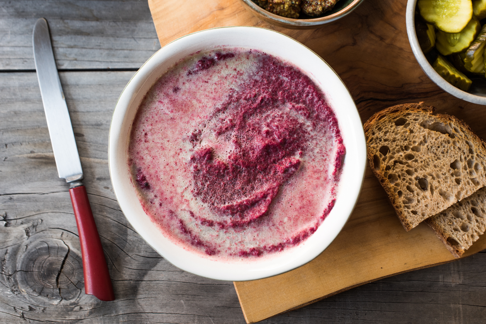

---
tags:
  - dish:pantry
  - ingredient:beet
---
# Beet and brown butter mousse

- Serves: 2-3 cups
{ #serves }
- Date added: 2023-08-27

## Description

The beet carries most of the flavor and texture here, but butter is an equally important component of this recipe. I always use salted butter, but if you prefer unsalted, be prepared to do lots of seasoning at the end; beets absorb a truly shocking amount of salt. Speaking of which, you can’t exactly reuse the salt crust, so choose a variety that’s inexpensive enough to not feel like a waste. I like plain old (non-iodized) table salt because it’s plentiful and dirt cheap, but your favorite kosher or sea salt will work just as well.

## Ingredients { #ingredients }
- 1 large red beet (about 1 pound), scrubbed clean
- 2-3 c salt (table salt or kosher salt are fine)
- 1 egg white
- 2 sticks butter
- 2 bay leaves
- 2 cloves garlic, peeled and smashed
- freshly cracked black pepper
- 1 shallot or .5 small yellow onion, peeled and thinly sliced into half-moons
- .5 c dry white wine or light beer
- zest and juice of .5 a lemon, plus more to taste
- 1 generous pinch of cayenne pepper
- .25 tsp ground garam masala, allspice, smoked paprika, or other warm spice

## Directions

1. Preheat oven to 400ºF and line the bottom of a small roasting dish or oven-safe skillet with about *.125*{.ingredient-num} inch of salt. Mix the remaining salt with the egg white in a bowl to create a malleable paste. Grab a handful, spread it out on your palm, and plop the beet right on top. Using your hands, keep smushing the salt paste on and around the beet until it's completely encased. Gently lay the salt-crusted beet in the roasting dish, transfer to the oven, and roast for at least 90 minutes, or up to two hours. (It's nearly impossible to overcook a whole beet of this size, so don't stress about leaving it in too long.)
2. While the beet roasts, place *1.5*{.ingredient-num} sticks of butter in a skillet along with the garlic, bay leaves, and loads of fresh black pepper. Melt everything together over very low heat and cook for 30-40 minutes, stirring every now and then to encourage even browning, until the garlic is super-soft and the butter solids turn golden brown. Pick out and discard the bay leaves, then transfer everything else to a heatproof bowl, scraping the bottom with a spatula to get every last bit of the browned goodness. Cover loosely with foil or a plate and refrigerate until the butter resolidifies, about an hour.
3. When the beet has cooked through, immediately crack open the salt shell with the dull edge of a chef's knife, being careful to avoid the steam that's trapped inside. Allow to cool until you can comfortably handle it. Rinse off any lingering salt, then rub the skin off with your fingers and roughly chop into one-inch pieces.
4. Melt another tablespoon of butter in the same skillet from earlier, over medium heat this time. Add the shallot or onion and cook, stirring occasionally, until softened and beginning to brown, 5 minutes for shallots and 10 or so for onions. Add the beet chunks and brown on all sides. Deglaze the pan with the wine or beer, crank the heat, and boil off as much of the liquid as you can. Stir in the lemon zest, juice, and spices, and transfer the contents of the skillet to the work bowl of a food processor.
5. Scrape the cooled butter and garlic cloves on top of the beets. Pulse to combine, then process until the mixture is totally smooth. Taste and adjust the seasoning as needed, adding more salt, spices, or lemon juice until you're happy with how it tastes. Scrape the mousse into a bowl, pressing it through a fine mesh-sieve if desired, and smooth out the top.
6. Wipe out the skillet, place over medium-low heat, and add the remaining three tablespoons of butter. Cook until the milk solids turn deep brown, 5 to 10 minutes, watching it carefully. A few wisps of smoke are OK and even good, but don't let the solids turn black. Cool slightly, then carefully scrape the browned butter on top of the mousse and tilt the bowl to evenly coat the surface. Cover with foil or a plate and refrigerate overnight. Serve with bread, grainy mustard, and plenty of pickles.

## Source
 [TASTE](https://www.tastecooking.com/recipes/salt-roasted-beet-browned-butter-mousse/)

## Comments

