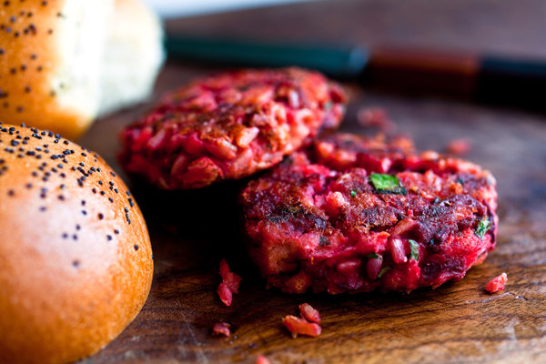

---
tags:
  - dish:main
  - ingredient:beet
  - protein:beans
---
# Beet, rice, and goat cheese burgers

- Serves: 6 burgers
{ #serves }
- Time: 30 minutes

## Description

For some reason these pink burgers tasted better to me after they’d sat for a day in the refrigerator. So make them ahead for quick meals through the week and reheat in a medium oven or a frying pan.

## Ingredients { #ingredients }

- 2 cups cooked brown or white rice
- 1 cup finely diced or grated roasted beets
- .25 cup chopped fresh herbs, like a mixture of parsley and dill
- 1 (15-ounce) can white beans, drained and rinsed
- 1 tablespoon fresh lemon juice
- 1 egg
- 2 ounces goat cheese, crumbled
- Salt and freshly ground pepper
- 2 tablespoons extra virgin olive oil or canola oil, as needed

## Preparation

1. Preheat the oven to 375 degrees. Combine the rice, beets and herbs in a large bowl.
2. Purée the beans with the lemon juice and egg in a food processor fitted with the steel blade or with a fork. Scrape into the bowl with the rice and beets. Add the goat cheese, salt and pepper, and mix the ingredients together.
3. Moisten your hands and form *6*{.ingredient-num} patties.
4. Working in batches, heat 1 tablespoon of the oil at a time in a heavy ovenproof skillet and brown the patties on one side for 2 minutes. Turn over onto the other side and place in the oven for 10 minutes. Serve with or without buns, ketchup and the works.

## Source 

[NYTimes](https://cooking.nytimes.com/recipes/1015441-beet-rice-and-goat-cheese-burgers)

## Comments
