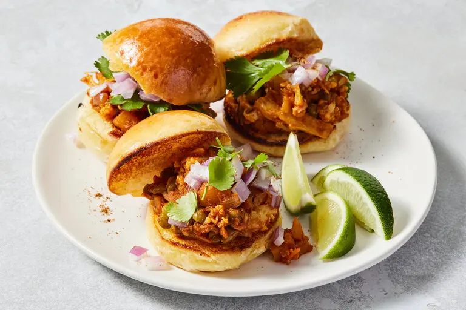

---
tags:
  - dish:main
  - ingredient:cauliflower
  - ingredient:potato
  - cuisine:indian
---
<!-- Tags can have colon, but no space around it -->

# Bhaji sliders

<!-- Serves has to be a single number, no dashes, but text is allowed after the
number (e.g., 24 cookies) -->
- Serves: 4
{ #serves }
<!-- Time is not parsed, so anything can be input here, and additional
values can be added (e.g., "active time", "cooking time", etc) -->
- Time: 50 min
- Date added: 2024-07-05

## Description

These spicy, hearty sandwiches are a simplified, quick take on pav bhaji, a popular Mumbai street food that is a celebration of humble vegetables — pav means bread in Hindi and bhaji means vegetables. Potatoes and cauliflower make the backbone of this hefty, generously spiced vegetarian main. Peas balance with sweetness. And although 4 tablespoons may seem like a lot of butter, in the end it’s vital to the characteristic texture of the dish: rich, glorious sloppiness. Served on a mini bun, the basic ingredients rise to the occasion and make for a fun and satisfying, albeit messy, slider. 

## Ingredients { #ingredients }

<!-- Decimals are allowed, fractions are not. For ranges, use only a single dash
and no spaces between the numbers. -->

- .25 cup ghee or vegetable oil
- 2 teaspoons cumin seeds
- 1 tablespoon ginger paste or 1 (2-inch) piece ginger, grated
- 1 tablespoon garlic paste or 8 garlic cloves, finely chopped
- 1 large red onion, finely chopped
- 4.5 tablespoons unsalted butter
- 3 tablespoons tomato paste
- 1 tablespoon ground coriander
- 1 tablespoon ground cumin
- 1.5 Kashmiri or other mild red chile powder
- .5 teaspoon ground turmeric
- 4 Thai green chiles, finely chopped
- Salt
- 1 large russet potato, peeled, cut into ¼-inch pieces
- .5 head cauliflower, cut into small florets, about 2 cups
- .5 cup frozen peas
- 2 tablespoons fresh lime juice (from 1 lime), plus lime wedges for serving
- 4 to 6 slider buns or mini potato buns
- 1 teaspoon garam masala
- .5 cup finely chopped cilantro

## Directions

<!-- If you have a direction that refers to a number of some ingredient, wrap
the number in asterisks and add `{.ingredient-num}` afterwards. For example,
write `Add 2 Tbsp oil to pan` as `Add *2*{.ingredient-num} to pan`. This allows
us to properly change the number when changing the serves value. -->
1. Heat ghee in a medium pot (about 10 inches in diameter) on high. Add cumin seeds and cook for 30 seconds until they darken and start to sputter. Add the ginger and garlic along with half of the onion. Cook, stirring occasionally, until onion is translucent, about 7 minutes.
2. Reduce heat to medium and add 4 tablespoons of the butter followed by the tomato paste, coriander, ground cumin, chile powder, turmeric, green chiles and 1 tablespoon salt. Cook, stirring often to ensure spices don’t stick and burn, until mixture is slightly darkened, about 1 minute.
3. Add potato, cauliflower and peas. Increase heat to high and stir in 1½ cups of water. When the mixture starts bubbling, decrease heat to medium, cover, and cook until potato is falling apart and cauliflower is tender, about 18 minutes. Uncover, Increase heat to high and continue cooking until most of the liquid has evaporated. Stir frequently and aggressively for about 5 minutes so that all the vegetables get smashed together. The mixture should be semi-solid, malleable and sticky. Remove from heat, add lime juice and mash to combine. Season with salt.
4. Toast the buns and spread the remaining ½ tablespoon butter on the interiors.
5. Assemble the sliders by scooping the bhaji onto the bottom of each bun. Top with the remaining onion, the garam masala and chopped cilantro. Serve with lime wedges.

## Notes

<!-- Delete section if no additional notes -->

Use a bag of frozen mixed vegetables to save time on prep; cook for an additional 3 to 4 minutes.

## Source

[NYTimes](https://cooking.nytimes.com/recipes/1025305-bhaji-sliders)

## Comments

- 2024-07-05: Delicious! comments recommended eating them as open-faced sandwiches, which I agree with. I quick-pickled the rest of the onion (with 1 tsp sumac and 1 Tbsp red wine vinegar) which was delicious
