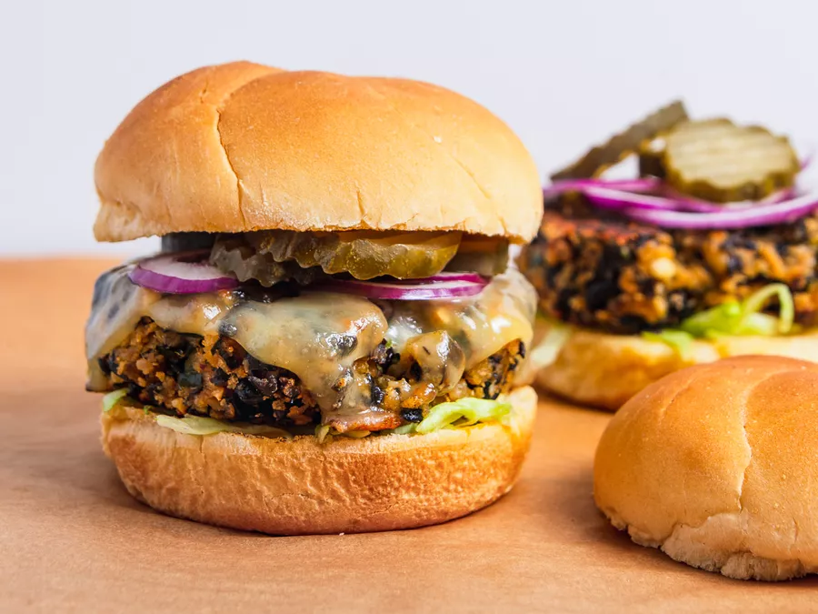

---
tags:
  - dish:main
  - protein:beans
---
# Black bean burgers

- Serves: 6
{ #serves }
- Active time: 45 mins

## Ingredients { #ingredients }

- 2 (15-ounce) cans black beans, rinsed and drained
- 4 tablespoons vegetable oil, divided
- 1 medium onion, finely chopped (about 1 cup)
- 1 large poblano pepper, finely chopped (about 1 cup)
- 3 medium cloves garlic, minced
- 1 chipotle chile in adobo sauce, finely chopped, plus 1 teaspoon sauce
- .75 cup roasted cashews
- .5 cup finely crumbled feta or cotija cheese
- .75 cup panko bread crumbs
- 1 large egg
- 2 tablespoons mayonnaise
- Kosher salt and freshly ground black pepper
- Cheese for topping, such as pepper jack, cheddar, muenster, or Swiss (optional)
- 6 to 8 hearty hamburger buns, toasted
- Condiments as desired, such as [chipotle mayonnaise](https://www.seriouseats.com/sauced-chipotle-mayonnaise-recipe), ketchup, mustard, or mayonnaise
- Toppings as desired, such as shredded lettuce, sliced onions, and pickles

## Directions

1. Adjust oven rack to center position and preheat oven to 350°F (175°C). Spread black beans in a single layer on a foil-lined rimmed baking sheet. Roast until beans are mostly split open and outer skins are beginning to get crunchy, about 20 minutes. Remove from oven and allow to cool slightly.
2. While beans roast, heat *2*{.ingredient-num} tablespoons oil in a medium skillet over medium-high heat until shimmering. Add onion and poblano and cook, stirring frequently, until softened, about 5 minutes. Add garlic and cook, stirring constantly, until fragrant, about 2 minutes. Add chipotle chile and sauce and cook, stirring, until fragrant, about 30 seconds. Transfer mixture to a large bowl.
3. Place cashews in the bowl of a food processor and pulse until chopped into pieces no larger than .33-inch, about 12 short pulses. Add to bowl with onions and peppers.
4. When beans are slightly cooled, transfer to food processor. Add cheese. Pulse until beans are roughly chopped (the largest pieces should be about .33 of a full bean in size). Transfer to bowl with onion/pepper mixture. Add bread crumbs, egg, and mayonnaise and season with salt and pepper. Fold together gently but thoroughly with hands. Patty mixture can be stored in an airtight container in the refrigerator for up to three days at this stage.
5. To cook indoors: Form bean mixture into *6*{.ingredient-num} to *8*{.ingredient-num} patties as wide as your burger buns. Heat 1 tablespoon oil in a large nonstick or cast iron skillet over medium heat until shimmering. Add 4 patties and cook, swirling pan occasionally, until well browned and crisp on first side, about 5 minutes. Carefully flip and cook until second side is browned, about 5 minutes longer, adding cheese if desired. If cooking more than 4 burgers, cook in batches, keeping cooked burgers on a rack set in a rimmed baking sheet in a 200°F oven while second batch cooks.
6. To cook on the grill: Light 2/3 chimney full of charcoal. When all the charcoal is lit and covered with gray ash, pour out and arrange the coals on one side of the charcoal grate. Set cooking grate in place, cover grill and allow to preheat for 5 minutes. Alternatively, set half the burners on a gas grill to the medium-high setting, cover, and preheat for 10 minutes. Clean and oil the grilling grate. Form bean mixture into 6 to 8 patties as wide as your burger buns and brush top sides with oil. Place on hot side of grill oiled-side down and cook without moving until first side is well browned, 3 to 5 minutes. Brush tops of burgers with oil. Carefully flip and continue cooking until second side is browned, 3 to 5 minutes longer, topping with cheese if desired.
7. Spread top and bottom buns with chipotle mayonnaise or other condiments as desired. Add toppings to top or bottom bun as desired. Place patties on bottom buns, close burgers, and serve immediately.

## Notes

Patty mixture can be made through step 4 and stored in a sealed container in the refrigerator for up to 3 days before forming patties and cooking as desired. To freeze, place formed patties on a parchment-lined baking sheet and place in freezer until fully frozen, about 1 hour. Remove from freezer and cut parchment around each burger. Stack frozen burgers with the parchment in between each layer. Transfer to a zipper-lock freezer bag and freeze for up to 3 months. To cook frozen burgers, break apart and spread in a single layer on a baking sheet or cutting board and allow to thaw at room temperature for 1 hour before cooking as directed. 

## Source

[Serious Eats](https://www.seriouseats.com/the-best-black-bean-burger-recipe)

## Comments
