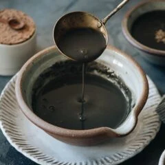

---
tags:
  - dish:dessert
  - cuisine:chinese
---
<!-- Tags can have colon, but no space around it -->

# Black Sesame Soup (黑芝麻糊)

<!-- Serves has to be a single number, no dashes, but text is allowed after the
number (e.g., 24 cookies) -->
- Serves: 5 cups
{ #serves }
<!-- Time is not parsed, so anything can be input here, and additional
values can be added (e.g., "active time", "cooking time", etc) -->
- Time: 10 min, plus soaking time
- Date added: 2025-11-29

## Description
This sweet and nutty black sesame soup makes a surprisingly delicious and nutritious dessert to cap off an Asian-themed meal! 

## Ingredients { #ingredients }

<!-- Decimals are allowed, fractions are not. For ranges, use only a single dash
and no spaces between the numbers. -->
 
- 2 tablespoons (30 g) glutinous rice
- 1/2 cup (75 g) toasted black sesame seeds 
- 4 tablespoons brown sugar (or to taste) 

## Directions

<!-- If you have a direction that refers to a number of some ingredient, wrap
the number in asterisks and add `{.ingredient-num}` afterwards. For example,
write `Add 2 Tbsp oil to pan` as `Add *2*{.ingredient-num} to pan`. This allows
us to properly change the number when changing the serves value. -->
1. Soak the glutinous rice for 4 hours at room temperature or overnight in the fridge.
2. Add the sesame seeds to a large skillet. Shake the pan so the seeds are spread out in a thin layer. Toast over medium heat until you can smell the fragrance, 2 to 3 minutes. (*Footnote 3)
3. Drain the soaked glutinous rice and transfer it to a blender, along with the toasted sesame seeds and 2 cups of water. Blend until it forms a very smooth soup, 1 minute in a Vitamix, or up to 3 minutes in a blender.
4. Transfer the mixture to a medium-sized saucepan. Add 3 cups of water. Heat over medium heat until boiling. Stir constantly during the whole process to prevent the bottom from sticking (*Footnote 4). When the soup starts to boil, turn to medium-low heat and add the sugar. Stir to melt the sugar and taste the soup. Adjust the seasoning by adding more sugar, if needed. The soup is ready to serve now. If you want the soup to be thicker, simmer it over low heat until it reaches desired consistency.
5. Enjoy the soup hot, warm, or at room temperature.

## Notes
- If you cannot find toasted black sesame seeds, you can use raw black sesame seeds. You will need to toast them for longer.
- You can use other sweeteners if you prefer. Rock sugar is a great alternative. Regular white sugar also works.
- If you’re using raw sesame seeds, toast them in a pan over medium-low heat for about 10 minutes, or until the seeds start popping (you can hear the sound).
- It’s very important to stir constantly when boiling the soup. The texture will thicken when it heats up and cause spilling and the bottom to burn unless stirred.
- Store the leftover soup in an airtight container in the fridge for up to 3 days or in the freezer for 2 months. The soup might separate in the fridge. Stir and reheat it in the microwave before serving.## Notes

## Source

[Omnivore's cookbook](https://omnivorescookbook.com/black-sesame-soup/#recipe)

## Comments
