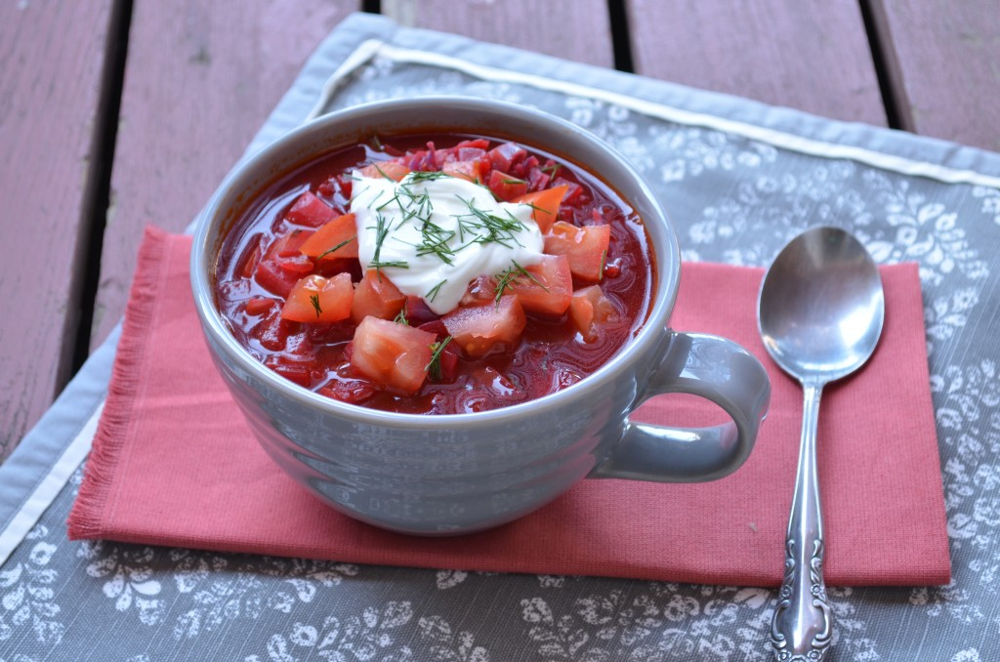

---
tags:
  - dish:soup
  - ingredient:beet
---
# Borscht

- Serves: 4
{ #serves }

## Ingredients { #ingredients }

- 4 cups vegetable stock
- 1 cup diced beets (about 1 medium-sized beet, peeled)
- 1.5 cups diced potato (I used 1 Yukon gold potato)
- 2 Tbs butter or Earth Balance
- 1.5 cups chopped yellow onion (about 1 onion)
- 1-2 tsp salt
- 1 tsp caraway seeds
- 1 large carrot, peeled and thinly sliced
- 1 stalk celery, sliced
- 3 cups chopped red cabbage
- 1 cup tomato puree
- 1 Tbsp cider vinegar
- 1 Tbsp honey
- .25 tsp chopped fresh dill
- black pepper to taste

### To top:

- fresh tomatoes, diced
- sour cream or Greek yogurt
- additional fresh dill

## Directions

1. In a large pot or Dutch oven, bring vegetable stock, beets, and potatoes to a boil. Cover, reduce heat, and simmer until tender, about 12-15 minutes. (It's OK if the potatoes are a bit more tender than the beets.) Drain, reserving the stock, and set aside.
2. In the same pot, heat butter over medium heat. Add onions, caraway seeds and *1*{.ingredient-num} tsp salt, and saute until the onion is translucent, about 3-4 minutes. Add carrot, celery, cabbage, and reserved vegetable stock. Cover and simmer until all the vegetables are tender, about 10 minutes. Stir in potatoes, beets, and all remaining ingredients.
3. Cover and simmer on low heat for 30 minutes. Taste and add more salt if desired.
4. Serve immediately, topped with chopped fresh tomatoes, Greek yogurt or sour cream, and a sprinkle of fresh dill.

## Source

New Moosewood Cookbook, via [Coffee and Quinoa](https://www.coffeeandquinoa.com/2013/04/moosewood-cookbook-borscht/)

## Comments

