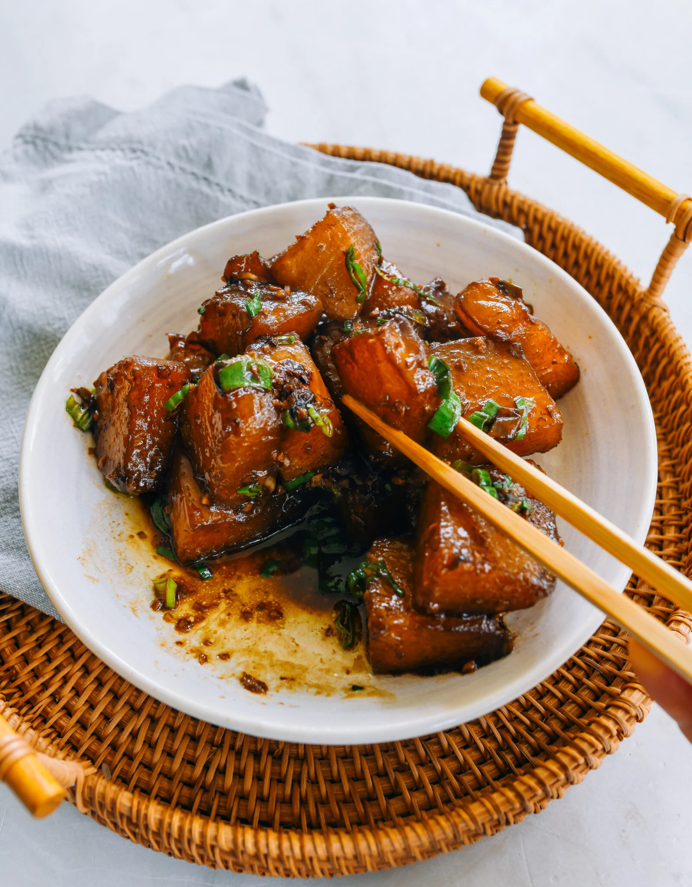

---
tags:
  - dish:sides
  - ingredient:winter melon
  - cuisine:chinese
---
<!-- Tags can have colon, but no space around it -->

# Braised Winter Melon

<!-- Serves has to be a single number, no dashes, but text is allowed after the
number (e.g., 24 cookies) -->
- Serves: 4
{ #serves }
<!-- Time is not parsed, so anything can be input here, and additional
values can be added (e.g., "active time", "cooking time", etc) -->
- Time: 35 min
- Date added: 2025-10-29

## Description
This braised winter melon recipe (红烧冬瓜 – hóngshāo dōngguā) is a simple, healthy, and delicious side dish that really highlights this subtle ingredient. 

## Ingredients { #ingredients }

<!-- Decimals are allowed, fractions are not. For ranges, use only a single dash
and no spaces between the numbers. -->
- 1.5 winter melon (seeds and skin removed)
- 2 tablespoons neutral oil (such as vegetable, canola, or avocado oil)
- 1 tablespoon minced garlic
- .5 teaspoon minced ginger
- 1 scallion (finely chopped; white and green parts separated)
- 1 tablespoon oyster sauce (or vegetarian oyster sauce)
- .5 teaspoon dark soy sauce
- .125 teaspoon white pepper
- .5 1 cup water
- 1 star anise (optional)
- Salt to taste (optional)

## Directions

<!-- If you have a direction that refers to a number of some ingredient, wrap
the number in asterisks and add `{.ingredient-num}` afterwards. For example,
write `Add 2 Tbsp oil to pan` as `Add *2*{.ingredient-num} to pan`. This allows
us to properly change the number when changing the serves value. -->
1. Process the winter melon by scooping out the seeds in the center. Trim off the peel and the tough green underlayer. Wash off any white powder left behind by the peel, then cut the melon into 1” x 1.5” (3-4cm) chunks.
2. Heat the oil in wok with medium heat, lightly brown both sides of the winter melon pieces, about 3 minutes per side.
3. Next, add the garlic, ginger, and the white parts of the scallion. Cook them for about 1 minute, until fragrant. Then add the oyster sauce, dark soy sauce and white pepper. Mix everything well.
4. Add the water and star anise (if using). Cover and simmer for 10 to 12 minutes, or until the winter melon is fork tender. (If there is still too much liquid, turn up the heat and stir for a couple of minutes to reduce and thicken the sauce).
5. Taste and add salt if needed. Toss in the scallion greens, and serve.

## Source
[Woks of Life](https://thewoksoflife.com/braised-winter-melon/)

## Comments
