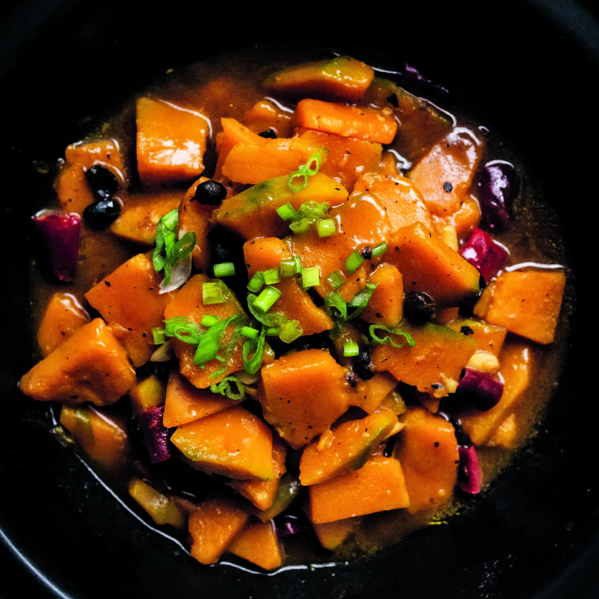

---
tags:
  - dish:main
  - ingredient:winter squash
---
# Braised winter squash with fermented black beans

- Serves: 4
{ #serves }
- Time: 20 minutes

## Description

Similar to red-braising (紅燒 hóngshāo), when you cover and slowly cook an ingredient in a flavorful liquid, smother-braising (燜 mèn) is simpler and shorter and often relies on more delicate, lighter-colored condiments instead of dark soy sauce, allowing the color of the vegetable to shine through.

In this dish, the squash’s natural sweetness is complemented by the salty, savory fermented black beans, and the squash is cooked until buttery and tender, on the verge of falling apart. My favorite is kabocha squash, which has a velvety, starchy softness and flavor reminiscent of roasted chestnut, but any firm-fleshed winter squash, like red kuri, butternut, or Hubbard, will work.

## Ingredients { #ingredients }

- 1 pound (450 grams) winter squash (about .5 small kabocha squash)
- 2 Tbsp. vegetable oil
- 4 or 5 dried red chiles, snipped into .5-inch pieces and seeds shaken out
- 1 Tbsp. fermented black beans, coarsely chopped
- 3 garlic cloves, thinly sliced
- 1 cup unsalted stock of any kind or water
- 1 tsp. sugar
- .5 tsp. kosher salt
- .5 tsp. toasted sesame oil
- Ground white pepper
- 1 scallion, green part only, thinly sliced, for garnish

## Directions

1. Peel and core the squash and cut it into 1.5-inch wedges, then cut the wedges into pieces .5 inch thick and 1.5 inches wide; you should have about 3 cups.
2. Heat a wok over high heat and add the scallion oil, swirling to coat the sides. Add the dried chiles and stir-fry until they begin to darken  in color, about 10 seconds. Add the fermented black beans and garlic and let them sizzle until fragrant, about 30 seconds. Add the squash pieces and stir them around the wok to pick up all the fragrant oil, then pour in the stock and bring to a boil. Season with the sugar and salt, then cover, reduce the heat to maintain a gentle simmer, and cook until the squash has absorbed most of the liquid and is tender enough to pierce with a chopstick, 4 to 5 minutes.
3. Uncover and taste for salt and sugar; adjust the seasoning if necessary. Remove from the heat, stir in the sesame oil and a dash of white pepper, scatter the sliced scallions on top, and serve.

## Source 

Vegan Chinese Kitchen, via [Epicurious](https://www.epicurious.com/recipes/food/views/braised-winter-squash-with-fermented-black-beans)

## Comments
