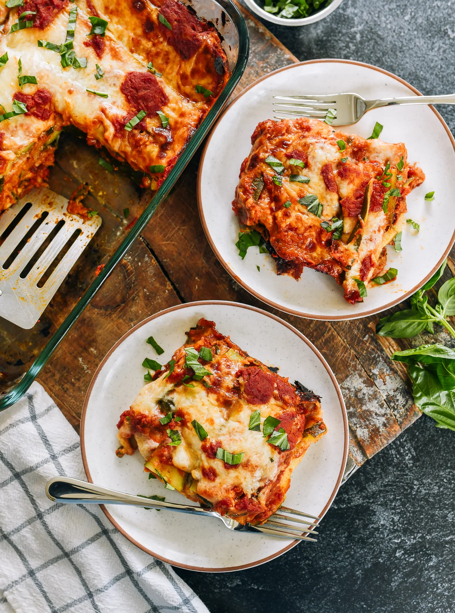

---
tags:
  - dish:main
  - ingredient:zucchini
---
<!-- Tags can have colon, but no space around it -->

# Zucchini Bread Lasagna

<!-- Serves has to be a single number, no dashes, but text is allowed after the
number (e.g., 24 cookies) -->
- Serves: 6
{ #serves }
<!-- Time is not parsed, so anything can be input here, and additional
values can be added (e.g., "active time", "cooking time", etc) -->
- Time: 1.5 hour
- Date added: 2025-10-29

## Description
This 6-Ingredient bread lasagna is easier to make than traditional lasagna, because instead of cooking pasta, you use sliced sourdough bread!

## Ingredients { #ingredients }

<!-- Decimals are allowed, fractions are not. For ranges, use only a single dash
and no spaces between the numbers. -->
- 2 pounds medium zucchini (3-4 zucchini)
- 16 ounces shredded low-moisture mozzarella cheese (about 4 cups)
- 1 cup grated parmesan cheese or grana padano
- 32 ounces marinara sauce (we like Rao’s)
- 12 ounces sourdough or other crusty bread (about 6-8 large ½-inch/1cm thick slices)
- .5 cup chopped fresh basil (optional)

## Directions

<!-- If you have a direction that refers to a number of some ingredient, wrap
the number in asterisks and add `{.ingredient-num}` afterwards. For example,
write `Add 2 Tbsp oil to pan` as `Add *2*{.ingredient-num} to pan`. This allows
us to properly change the number when changing the serves value. -->
1. Position a rack in the center of your oven and preheat to 375°F/190°C. Bring a large pot of water to a boil. Add the whole zucchini, and bring back to a boil. Cover and simmer until the zucchini are almost tender throughout, about 13-15 minutes (13 minutes for smaller zucchini, and 15 minutes for thicker zucchini).
2. Combine the mozzarella and parmesan cheese in a bowl. Drain the zucchini, cool, and slice lengthwise into ½-inch-thick slices.
3. In a 9-by-13-inch baking dish, spread ½ cup of marinara sauce along the bottom, and top with one even layer of bread, cutting slices of bread to fit as necessary. Then add a layer of marinara sauce, followed by a layer of cheese and half the basil, sprinkled evenly (if using). Then add a layer of zucchini slices.
4. Continue layering as follows: sauce, cheese, bread, sauce, cheese, the remaining basil, and the remaining zucchini. Finish with another layer of sauce and cheese on top, and if you have any remaining tomato sauce, dollop the rest of it on top.
5. Cover tightly with foil, and place the lasagna pan on a rimmed baking sheet. Transfer to the preheated oven and bake for 35 minutes. Then remove the foil and bake for another 15 minutes, or until the top is golden brown and bubbly. Let the lasagna set for 5-10 minutes before slicing and serving.

## Source

[Woks of Life](https://thewoksoflife.com/bread-lasagna-zucchini/)

## Comments
