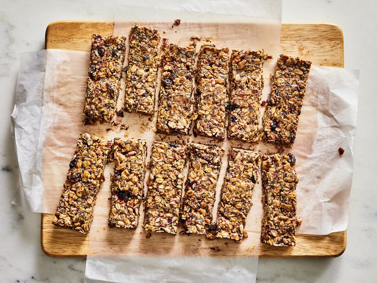

---
tags:
  - dish:breakfast
  - dish:baking
---
<!-- Tags can have colon, but no space around it -->

# Breakfast bars

<!-- Serves has to be a single number, no dashes, but text is allowed after the
number (e.g., 24 cookies) -->
- Serves: 1 batch
{ #serves }
<!-- Time is not parsed, so anything can be input here, and additional
values can be added (e.g., "active time", "cooking time", etc) -->
- Time: 30 min, plus 8 hrs cooling
- Date added: 2025-10-29

## Description
Breakfast bars are great for a meal on the run or an afternoon nibble, but while it’s tempting to reach for a store-bought bar, they’re often too sweet, aggressively spiced, and either so chewy they stick to the roof of your mouth, or dangerously hard with jagged edges that cut into your tongue. To avoid this, we encourage you to take the (mostly hands-off) time to make your own at home with our easy recipe for homemade breakfast bars that are lightly sweet, full of flavor, and have just the right texture.

Our perfect bar is hearty with a crunchy exterior that gives way to a softer, chewier center. It’s well seasoned, with just a touch of caramelized sweetness and a kaleidoscope of dried fruits, toasted oats, and crunchy seeds, plus it requires little more than tossing everything together, pressing into the pan, and refrigerating until firm. To get to this great result, we asked our test kitchen colleague Renu Dhar to methodically make batch after batch of seed-filled bars to come up with wholesome and satisfying breakfast bars. 

### Why It Works

- A blend of dried fruits, seeds, and fruit preserves provides a compelling mix of flavors, colors, and textures.
- Toasting the oats with brown sugar and honey before mixing with the other ingredients creates a deep butterscotch flavor.
- Creamy nut butter (or sunflower butter) binds the oats and seeds together so the bars hold their shape when sliced.

## Ingredients { #ingredients }

<!-- Decimals are allowed, fractions are not. For ranges, use only a single dash
and no spaces between the numbers. -->

- Cooking spray
- 1.5 cups uncooked old-fashioned rolled oats (5 1/2 ounces; 156 g)
- 2 tablespoons light brown sugar (5/8 ounce; 20 g)
- 1 tablespoon (15 ml) extra-virgin olive oil 
- 3 tablespoons (45 ml) honey, divided
- 5 medium pitted Medjool dates, roughly chopped (about 1/2 cup)
- .75 cup (180 ml) unsweetened creamy sunflower seed butter, peanut butter, almond butter, or cashew butter
- .25 cup unsweetened dried blueberries, raisins, currants, chopped dried figs, or dried cranberries (1 3/4 ounce; 50 g) 
- .25 cup chia seeds (1 1/2 ounces; 45 g)
- .25 cup hemp seeds (1 3/8 ounces; 40 g)
- .25 cup raw unsalted sunflower kernels (1 1/4 ounces; 40 g)
- 2 tablespoons (30 ml) fruit preserves, such as blueberry, cherry, or raspberry
- .5 teaspoon kosher salt

## Directions

<!-- If you have a direction that refers to a number of some ingredient, wrap
the number in asterisks and add `{.ingredient-num}` afterwards. For example,
write `Add 2 Tbsp oil to pan` as `Add *2*{.ingredient-num} to pan`. This allows
us to properly change the number when changing the serves value. -->

1. Adjust oven rack to middle position and preheat oven to 325°F(160℃). Coat an 8-inch square baking pan with cooking spray; line bottom and sides with parchment paper, leaving a 2-inch overhang on all sides. Line a large baking sheet with parchment paper. Set both aside.
2. In a medium bowl, stir oats, brown sugar, oil, and 2 tablespoons of the honey until well combined. Spread oat mixture evenly onto the parchment-lined baking sheet. Bake, stirring every 5 minutes and returning to an even layer, until golden brown and crisp, about 15 minutes. Let cool completely on a wire rack, about 15 minutes.
3. While oats are cooling, in a food processor, process dates and seed or nut butter until smooth, 1 to 2 minutes, scraping down sides of processor bowl as needed. 
4. In a large bowl, stir together the cooled oats, sunflower butter mixture, dried fruit, chia seeds, hemp seeds, sunflower kernels, fruit preserves, salt, and remaining 1 tablespoon honey until well combined and the mixture holds together, 1 to 2 minutes.
5. Spread oat mixture firmly into the bottom of prepared baking pan, using bottom of a greased measuring cup to press into a flat even layer. Press plastic wrap directly onto surface of oats mixture; wrap baking pan in additional plastic wrap, and refrigerate until cold and firm, at least 8 hours or up to 3 days. 
6. Remove and discard plastic. Using parchment overhang as handles, remove bars; place on a cutting board. Cut bars into 1 1/4- x 4-inch squares. Serve or refrigerate in an airtight container for up to 3 weeks.  

## Source

[Serious Eats](https://www.seriouseats.com/breakfast-bars-recipe-8695308)

## Comments
