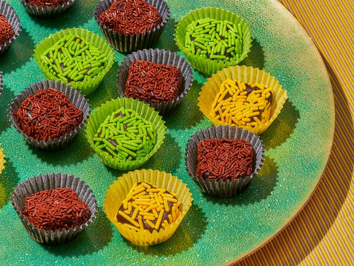

---
tags:
  - dish:desserts
  - ingredient:cocoa
  - ingredient:condensed milk
---
# Brigadeiros

- Date added: 2023-08-27

## Description

The Brazilian sweets known as brigadeiros are a classic treat at birthday parties and family get-togethers, where the fudgy, chocolate-milk caramels are often rolled in sprinkles. The chef Natalia Pereira of Woodspoon in Los Angeles also makes more grownup, bittersweet brigadeiros by rolling them in cocoa powder or shredded coconut. Try her recipe, which she learned from her mother in Minas Gerais, Brazil, using either canned condensed milk or a homemade version. Either way, the candies will be tender and delicious. —Tejal Rao

From the comments: 

- can also roll in coconut or crushed nuts.
- shouldn't be *too* cold when you eat it (closer to room temperature than fridge temperature).
- if you don't cook it for so long, so it's a bit softer, can eat directly with a spoon or spread on bread.

## Ingredients { #ingredients }

### For the Sweetened Condensed Milk (optional):

- 5 cups whole milk
- 1 cup granulated sugar

### For the Brigadeiros:

- 2 teaspoons unsalted butter, plus more for greasing your hands
- 1.75 cups homemade sweetened condensed milk or 1 (14-ounce) can sweetened condensed milk
- 5 tablespoons unsweetened Dutch-process cocoa powder, sifted
- Pinch of flaky sea salt
- 1 cup chocolate or rainbow sprinkles

## Preparation

1. If using store-bought condensed milk, skip to Step 2. If making the sweetened condensed milk from scratch, add the milk and sugar to a large saucepan. Heat over medium-low, and simmer, stirring occasionally and scraping the sides and bottom of the pan with a spatula, for about 30 to 40 minutes. When the milk reduces to about 1.75 cups, thickens to a syrup texture and turns slightly yellow, it is ready.
2. Prepare the brigadeiros: Melt the butter in a heavy skillet over low heat. Add the condensed milk, cocoa powder and salt, and whisk until no trace of cocoa remains, about 5 minutes.
3. Turn the heat up to medium, and use a heatproof spatula to stir the mixture constantly until it becomes thick and shiny and pulls away from the bottom of the pan as a mass when you drag the spatula across it, about 7 minutes. If you’re not sure the mixture is ready, take .5 teaspoon of it and run it under cold water. When it’s cool enough to touch, squish it with your fingers — it should be the texture of a soft and fudgy caramel.
4. Scrape all of the mixture onto a piece of parchment paper, and let it cool down until it’s easy to handle, about 30 minutes. Lightly butter your hands, and use them to shape a scant tablespoon of the mixture into a ball or rough cube, then roll it in the sprinkles. Place each one on a paper wrapper, if you like. The brigadeiros will keep in the fridge for 1 week, or in the freezer for 1 month. Serve chilled or at room temperature.

## Source

[NYTimes Cooking](https://cooking.nytimes.com/recipes/1021918-brigadeiros)

## Comments
