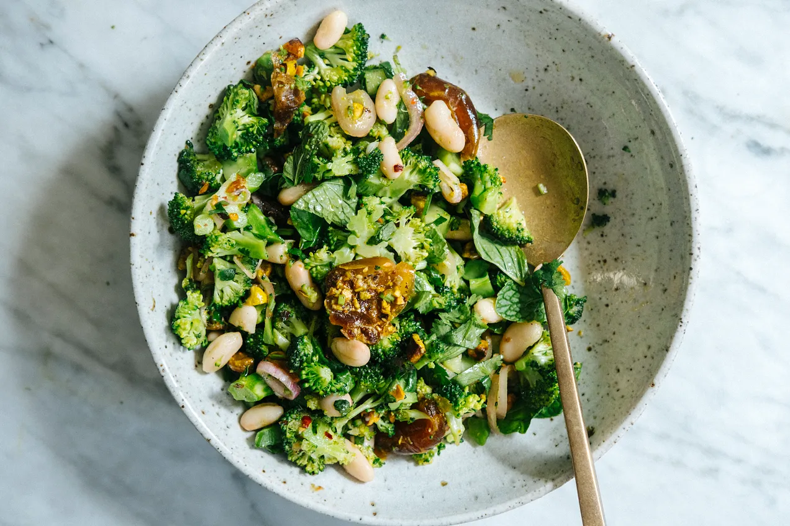

---
tags:
  - dish:main
  - protein:beans
  - ingredient:broccoli
  - difficulty:easy
---
<!-- Tags can have colon, but no space around it -->

# Broccoli, date, and pistachio salad

<!-- Serves has to be a single number, no dashes, but text is allowed after the
number (e.g., 24 cookies) -->
- Serves: 4
{ #serves }
<!-- Time is not parsed, so anything can be input here, and additional
values can be added (e.g., "active time", "cooking time", etc) -->
- Time: 
- Date added: 2024-03-20

## Description

Spurred by date possibilities, I started envisioning a broccoli and date salad. Similar to this beloved broccoli salad which I developed for NYT Cooking a few years ago, I use chopped up broccoli, but unlike that salad, where the broccoli is raw, I decided to give then a quick toss in a skillet, just to take off the raw edge and coax out a little more flavour. I contemplated a tahini dressing, but ended up opting for a ras el hanout spiced vinaigrette (you can use other spices, see recipe below). There is not one definitive recipe for ras el hanout - each family will have their own blend - but common spices are cumin, cardamom, clove, cinnamon, nutmeg, allspice, ginger, coriander, peppercorns and more. It’s a heady spice, intense and warming, and pairs particularly well with syrupy dates.

Like my NYT broccoli salad, this one stores well and keeps getting better. I made it on Monday and ate it for dinner for the next 4 nights. One night I added some leftover crumbled tofu I found in the fridge, another time I added some avocado. the dates soften over the days and loving coat the broccoli and beans. Each mouthful is a reward.

## Ingredients { #ingredients }

<!-- Decimals are allowed, fractions are not. For ranges, use only a single dash
and no spaces between the numbers. -->

- 600g (21-ounces) broccoli
- extra virgin olive oil
- sea salt and black pepper
- 1 425g tin cannellini beans or chickpeas, drained (drained weight 250g)
- 1/3 cup (80g) toasted pistachios or almonds, roughly chopped
- 12 regular dates or 6 medjool dates, pitted and torn
- handful chopped coriander/cilantro leaves
- handful mint leaves

### Spiced vinaigrette
- 2 teaspoon ras el hanout, baharat or curry powder (or a single spice like ground cumin, coriander, turmeric)
- 2 tablespoons white wine or champagne vinegar
- .25 cup (60ml) extra virgin olive oil
- 1 small shallot (eschalot), thinly sliced
- 1 clove garlic, finely grated
- 1 tablespoon maple syrup
- .25 - .5 teaspoon red chilli/pepper flakes
- .5 teaspoon sea salt

## Directions

<!-- If you have a direction that refers to a number of some ingredient, wrap
the number in asterisks and add `{.ingredient-num}` afterwards. For example,
write `Add 2 Tbsp oil to pan` as `Add *2*{.ingredient-num} to pan`. This allows
us to properly change the number when changing the serves value. -->
1. In a bowl, combine the as el hanout, baharat or curry powder, vinegar, olive oil, shallot, garlic, maple syrup, red chilli/pepper flakes and salt. Stir to combine. Set aside to allow the shallots to soften.
2. Finely chop the broccoli flowers. Remove the woody exterior of the stalk and then finely chop it and add to the rest of the broccoli.
3. Heat a large frying pan (skillet) on medium high for 2 minutes. When hot, drizzle with olive oil and add the broccoli, season with 1/2 teaspoon of salt and lots of black pepper and toss for 2 minutes. Transfer to a large bowl.
4. To the broccoli, add the beans or chickpeas, pistachio, and dates. Add the dressing and toss to evenly distribute. Add the herbs, season with salt and black pepper and toss again.

## Notes

<!-- Delete section if no additional notes -->
- If you don’t have dates, you could go for dried fruit like raisins (sultanas), apricots, cranberries or figs – I would soak them in a couple tablespoons of water, orange juice or 1 part vinegar mixed with 3 parts water to rehydrate them and make them plump and juicy.
- Storage: The salad can be prepped ahead and stored in the fridge for up to 5 days.

## Source

[To Vegetables, With Love](https://tovegetableswithlove.substack.com/p/broccoli-date-and-pistachio-salad)

## Comments

- 2024-03-20: Very tasty! made this with pumpkin seeds instead of pistachios and cooked the broccoli for a little longer
