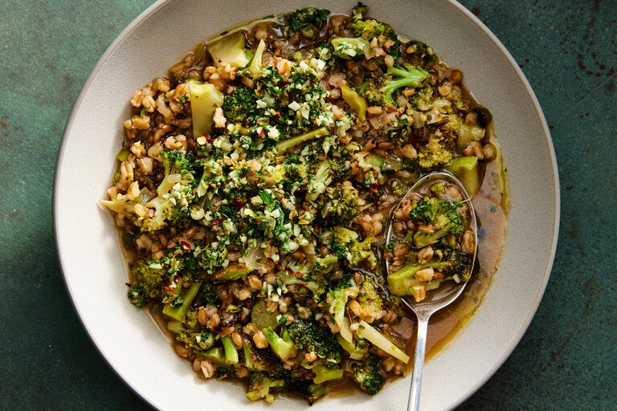

---
tags:
  - dish:main
  - ingredient:farro
  - ingredient:broccoli
  - difficulty:easy
---
<!-- Tags can have colon, but no space around it -->

# Broccoli and Farro Stew With Capers and Parsley

<!-- Serves has to be a single number, no dashes, but text is allowed after the
number (e.g., 24 cookies) -->
- Serves: 4
{ #serves }
<!-- Time is not parsed, so anything can be input here, and additional
values can be added (e.g., "active time", "cooking time", etc) -->
- Time: 45 min
- Date added: 2024-01-28

## Description

This farro and broccoli stew is as hearty, cozy and full of green vegetables as you might expect, but you may be surprised to taste how effervescent it is. Bowls are piquant with white wine and a mix of garlic, capers and parsley, plus chile that’s used two ways: fried with farro to build the ground floor of the stew, and more to finish for bite. The broccoli is caramelized and sweet — so much more than plain boiled broccoli — and the farro adds bouncy chew. This stew is so lively, you don’t need cheese (but it wouldn’t hurt). Enjoy as a vegan main dish, perhaps with crusty bread for dunking, or as a side dish to roasted sausage or chicken or steamed clams or fish.

## Ingredients { #ingredients }

<!-- Decimals are allowed, fractions are not. For ranges, use only a single dash
and no spaces between the numbers. -->

- 5 garlic cloves
- Heaping .5 cup chopped parsley leaves and stems
- 3 tablespoons rinsed capers
- 1 teaspoon red-pepper flakes
- 4 tablespoons extra-virgin olive oil, plus more as needed
- 1 pound broccoli florets and thinly sliced stems
- 1 yellow onion, coarsely chopped
- 1 cup farro
- Salt
- 1.25 cups dry white wine (or substitute with lemon, see Tip)
- 4 cups vegetable stock (or chicken or beef broth)

## Directions

<!-- If you have a direction that refers to a number of some ingredient, wrap
the number in asterisks and add `{.ingredient-num}` afterwards. For example,
write `Add 2 Tbsp oil to pan` as `Add *2*{.ingredient-num} to pan`. This allows
us to properly change the number when changing the serves value. -->

1. On a cutting board, coarsely chop the garlic. Add the parsley and capers to the garlic; chop everything together until finely chopped. (You can also pulse the mixture in the food processor, if that’s easier for you.) Transfer to a small bowl and stir in the red-pepper flakes. Reserve the cutting board without cleaning it.
2. Heat 2 tablespoons oil in a large pot or Dutch oven over medium-high. Add a single layer of the broccoli and cook, undisturbed, until browned underneath, 3 to 4 minutes. Transfer to the reserved cutting board, then repeat with the remaining broccoli, adding more oil when the pot gets dry.
3. To the now-empty pot, reduce the heat to medium and add 2 tablespoons oil. Add the onion, farro and half of the parsley-caper mixture (about ¼ cup, but no need to measure). Season with salt, then stir until the farro is darker in color and the garlic is fragrant, 2 to 3 minutes. Add the wine, increase heat to medium-high and scrape up browned bits on the bottom of the pot. Simmer until the wine is reduced by half, 2 to 3 minutes. Add the stock and 2 cups of water; season lightly with salt and bring to a boil. Reduce heat to simmer gently for 10 minutes.
4. Meanwhile, coarsely chop the broccoli until small enough to fit on your spoon. After the farro has cooked for 10 minutes, add the broccoli and simmer until the farro and broccoli are tender, 10 to 15 minutes. Remove from heat and season to taste with salt.
5. Divide among bowls; top with the remaining parsley-caper mixture and a drizzle of olive oil. Leftovers will keep for up to 3 days, but the soup will thicken as the farro continues to drink up the broth. You can thin leftovers with more stock, but the dish is actually better warm, like porridge, or cold, as a grain salad.

## Notes

<!-- Delete section if no additional notes -->

If you’d prefer not to use wine, you can mimic the brightness by finishing the soup with lemon zest and juice to taste.

## Source

[NYTimes](https://cooking.nytimes.com/recipes/1023896-broccoli-and-farro-stew-with-capers-and-parsley)

## Comments

- 2024-01-28: used this as inspiration, but swapped out the broccoli for a bunch each of collards and chard, the parsley for a mix of dill and rosemary, and the farro for a 50/50 farro/barley mixture. then sauteed 4 cevapi, chopped them up and added them (along with the oil they had been sauteed in) to the soup at the very end. was delicious!
