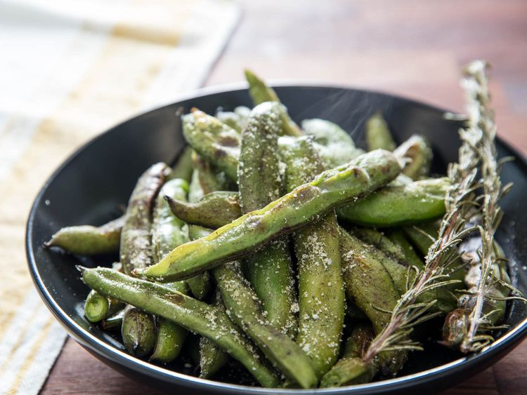

---
tags:
  - dish:sides
  - ingredient:fava
---
<!-- Tags can have colon, but no space around it -->

# Broiled Fava Beans With Dill and Garlic Salt

<!-- Serves has to be a single number, no dashes, but text is allowed after the
number (e.g., 24 cookies) -->
- Serves: 4
{ #serves }
<!-- Time is not parsed, so anything can be input here, and additional
values can be added (e.g., "active time", "cooking time", etc) -->
- Time: 20 min
- Date added: 2025-06-22

## Description
Make delicious springtime fava beans simpler by broiling them in their pods, then tossing them with a seasoning salt for a peel-and-eat snack.

### Why it works
- Broiling the favas imparts a delicate charred flavor, while the beans gently steam inside.
- Tucking rosemary under the favas adds a light but herbaceous aroma while they cook.
- Blending the seasoning salt in a spice grinder makes a fine powder that easily sticks to the pods and your fingers to season the beans while you peel and eat.

## Ingredients { #ingredients }

<!-- Decimals are allowed, fractions are not. For ranges, use only a single dash
and no spaces between the numbers. -->

- 2 pounds (900 g) fava beans
- 3 tablespoons (45 ml) olive oil
- 5 sprigs fresh rosemary
- 1 tablespoon (12 g) kosher salt
- 1.5 teaspoons dried dill
- .5 teaspoon garlic powder
- .5 teaspoon onion powder

## Directions

<!-- If you have a direction that refers to a number of some ingredient, wrap
the number in asterisks and add `{.ingredient-num}` afterwards. For example,
write `Add 2 Tbsp oil to pan` as `Add *2*{.ingredient-num} to pan`. This allows
us to properly change the number when changing the serves value. -->

1. Preheat oven's broiler. Line a rimmed baking sheet with foil.
2. In a large bowl, toss fava beans with olive oil. Spread rosemary sprigs across baking sheet and evenly distribute fava beans on top. Broil until lightly charred, about 8 minutes. Remove from oven and let fava beans steam in their pods before consuming, about 5 minutes.
3. While fava beans are broiling, prepare the seasoning salt. In a spice grinder, blend together kosher salt, dill, garlic powder, and onion powder until fine. Sprinkle some of the salt over the pods, reserving the rest for dipping beans as you peel and eat. 

## Source

[Serious Eats](https://www.seriouseats.com/broiled-fava-beans-with-dill-and-garlic-salt)

## Comments
