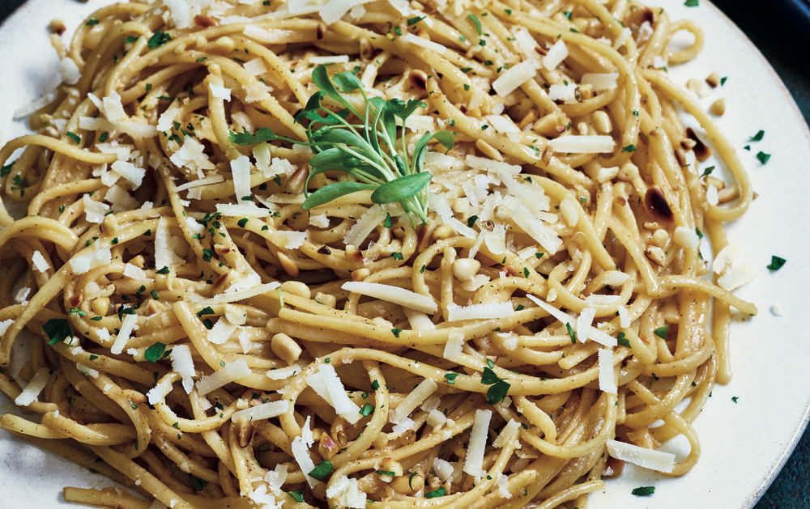

---
tags:
  - pasta / noodles
---
# Brown Butter & Miso Pasta 

- Serves: 2
{ #serves }

## Description

This is a super easy, quick mid-week dinner and a fantastic way to introduce Japanese miso into your everyday cooking. It is also terribly addictive. Different miso brands will vary in saltiness, so always check and adjust the quantities if necessary.

## Ingredients { #ingredients }

### For the pasta

- 200g (7oz) dried linguine pasta
- 2 tbsp pine nuts
- 2 tbsp chopped flat-leaf parsley
- freshly ground black pepper
- 2 tbsp freshly grated Parmesan cheese
- micro parsley or basil (optional)

### For the sauce

- 75g (2.75 oz/ .33 cup) unsalted butter
- 1 banana shallot, peeled and finely sliced
- 2 tbsp light brown or white miso paste

## Directions

1. In a large pan filled with boiling salted water, cook the linguine until al dente following the packet instructions. Drain, reserving some of the cooking liquor.
2. Meanwhile, dry-fry the pine nuts in a non-stick frying pan (skillet) until lightly golden, then roughly chop and set aside until needed.
3. Make the sauce in the same frying pan (skillet). Melt the butter, stirring from time to time. When the butter starts to brown and smell slightly nutty, lower the heat and add the shallot, coating it in the butter. Cook for a couple of minutes until the shallot is softened, remove from the heat, then add the brown miso paste and a few tablespoons of the reserved pasta cooking liquor. Using a whisk, mix the miso vigorously into the browned butter until the sauce is well combined, creamy and lump-free.

4. Add the drained pasta to the pan with the sauce and add the pine nuts, parsley and black pepper and toss well. Finish off with a generous sprinkle of Parmesan cheese and some micro parsley or basil, if you wish, and serve immediately.

## Source

[Splendid Table](https://www.splendidtable.org/story/2018/12/03/brown-butter-and-miso-linguine)

## Comments
