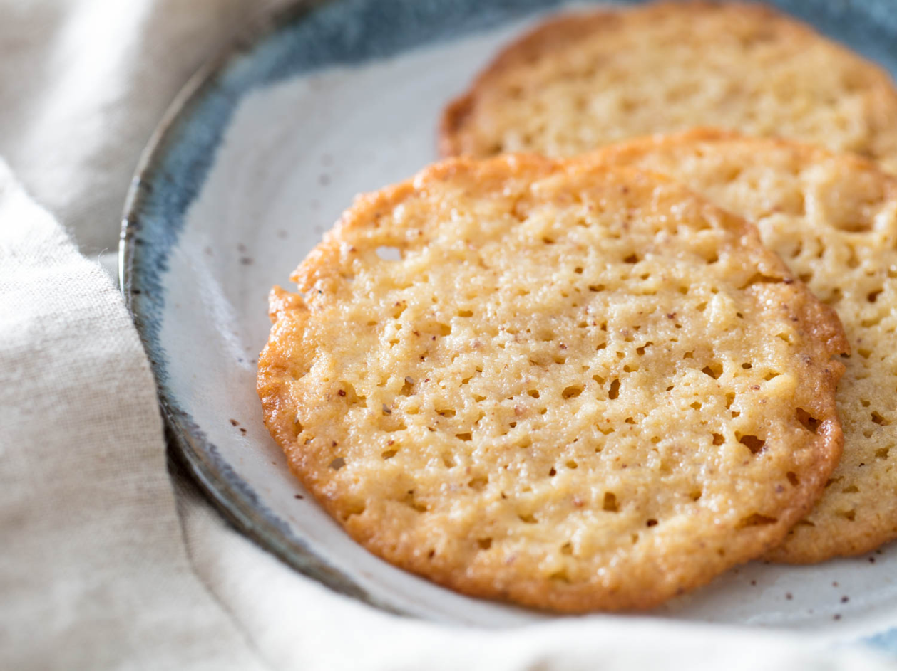

---
tags:
  - desserts
---
# Brown Butter and Ricotta cookies

- Serves: 35 cookies
{ #serves }
- Active time: 15 minutes
- Total time: Up to 2 hours

## Description

These thin and lacy cookies are oh-so-slightly crisp around the edges, with chewy middles that are nutty and rich—eating them is like mainlining brown butter. The secret to their incredible texture is ricotta, which helps the cookies bubble and spread as they bake.

Why It Works:

- Brown butter gives the cookies a toasted, nutty flavor.
- Ricotta helps the cookies spread out lacy and thin.
- Baking soda improves browning and spread.

The appearance of these cookies will vary with the fat and moisture contents of the ricotta, which differ wildly from brand to brand, but their delicious flavor will remain the same.

## Ingredients { #ingredients }

- 5 ounces unsalted butter (about 10 tablespoons; 140g)
- 1 leftover vanilla bean pod, optional (see this article on working with leftover vanilla)
- 7 ounces plain or toasted sugar (about 1 cup; 195g)
- 2 teaspoons (10g) vanilla extract
- 1 teaspoon (4g) Diamond Crystal kosher salt; for table salt, use about half as much by volume or the same weight
- .25 teaspoon (1.25g) baking soda
- 4 ounces cold ricotta (about .5 cup; 110g), strained if watery (see note)
- 4.5 ounces all-purpose flour, such as Gold Medal (about 1 cup, spooned; 125g)

## Directions

1. Getting Ready: In a large skillet, melt butter over medium-low heat. When it has completely melted, add vanilla pod (if using) and increase heat to medium. Simmer, stirring and scraping with a heat-resistant spatula while butter hisses and pops. When butter is golden yellow and perfectly silent, remove from heat and pour into a medium bowl, making sure to scrape up all the toasty brown bits from along the bottom. Cool until slightly thickened and opaque, but still slightly warm, around 80°F (27°C). This will take about 75 minutes at room temperature or 25 minutes in the fridge; if refrigerating, stir butter every 6 minutes or so to prevent it from hardening around the edges of the bowl.
2. Make the Dough: Adjust oven rack to middle position and preheat to 350°F (180°C). When brown butter has cooled, remove vanilla pod (if using) and stir in sugar, vanilla extract, salt, and baking soda. Stir until baking soda is well distributed, about 1 minute, then fold in cold ricotta. Once ingredients are combined, stir in flour to form a soft dough.
3. Portioning the Dough: Divide into 1-tablespoon portions and arrange on a parchment-lined half sheet pan, leaving about 4 inches between cookies to account for their significant spread. (If you like, the dough can be placed on a parchment-lined plate and frozen until firm, then transferred to a zip-top bag for storage. It can be refrigerated for up to 1 week or frozen for up to 3 months.)
4. Bake until cookies are lacy, thin, and golden brown around the edges, but still rather pale in the middle, about 12 minutes. Cool completely on baking sheet, as the cookies will be doughy and soft while warm. Enjoy after cooling, or store up to 1 week in an airtight container at room temperature.

## Source

[Serious Eats](https://www.seriouseats.com/recipes/2018/02/lacy-brown-butter-and-ricotta-cookies.html)

## Comments
