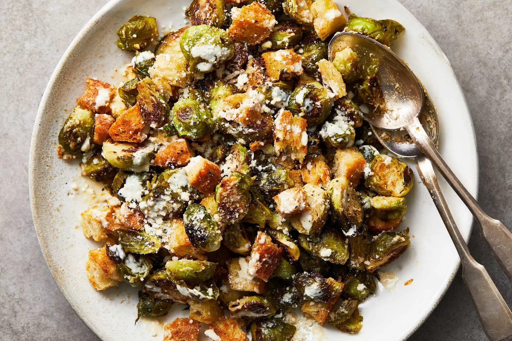

---
tags:
  - dish:sides
  - ingredient:brussels sprouts
  - difficulty:easy
---
<!-- Tags can have colon, but no space around it -->

# Roasted Brussels Sprouts Caesar With Tahini

<!-- Serves has to be a single number, no dashes, but text is allowed after the
number (e.g., 24 cookies) -->
- Serves: 4
{ #serves }
<!-- Time is not parsed, so anything can be input here, and additional
values can be added (e.g., "active time", "cooking time", etc) -->
- Time: 30 min
- Date added: 2025-01-05

## Description
This wintery twist on Caesar salad upholds the beloved creamy, crunchy and punchy characteristics while opting for a new set of greens — and a flavorful vegetarian alternative to anchovies. Tahini acts as both the thickening agent for the dressing, binding it together, and the flavor maker: Its sesame seed nuttiness and creamy texture balance the bitter undertones of the roasted brussels sprouts, which form the base of this salad. Quartering the sprouts decreases the cooking time and their size, so you can eat them by the forkful. 

## Ingredients { #ingredients }

<!-- Decimals are allowed, fractions are not. For ranges, use only a single dash
and no spaces between the numbers. -->
- 2 pounds brussels sprouts, ends trimmed, large ones quartered, smaller ones halved
- 6 tablespoons olive oil
- 1 teaspoon ground cumin
- .25 crushed red pepper
- Salt and pepper
- 3 cups of ½-inch bread cubes (from about .5 French baguette or loaf of crusty bread)
- 1 large lemon, juiced (about 3 tablespoons)
- 2 tablespoons tahini
- 1 garlic clove, grated or minced
- 2 tablespoons plus ¼ cup grated Parmesan

## Directions

<!-- If you have a direction that refers to a number of some ingredient, wrap
the number in asterisks and add `{.ingredient-num}` afterwards. For example,
write `Add 2 Tbsp oil to pan` as `Add *2*{.ingredient-num} to pan`. This allows
us to properly change the number when changing the serves value. -->
1. Heat the oven to 425 degrees. On a sheet pan, drizzle the brussels sprouts with 3 tablespoons olive oil; season with the cumin and red pepper, plus salt and pepper. Toss until everything is glistening.
2. Roast until the brussels sprouts start to brown in spots, 12 to 15 minutes.
3. In a medium mixing or serving bowl, toss the bread with 1 tablespoon oil and season lightly with salt. Remove the brussels sprouts from the oven, move them around with a wooden spoon, spread out in an even layer and add the bread cubes on top. Cook until the sprouts are tender and browned and the bread toasted, 8 to 12 minutes more.
4. Meanwhile, in the same bowl, combine the lemon juice, tahini and garlic with 2 tablespoons grated Parmesan, 2 tablespoons water and the remaining 2 tablespoons of olive oil until smooth. Remove the sheet pan from the oven. Drizzle with the dressing, sprinkle with most of the remaining ¼ cup cheese and toss to combine.
5. Transfer to the serving bowl or serve directly from the sheet pan. Garnish with the remaining cheese and a few grinds of pepper.

## Source
[NYTimes](https://cooking.nytimes.com/recipes/1025950-roasted-brussels-sprouts-caesar-with-tahini)

## Comments

- 2025-01-05: I thought the dressing was a little lemony, so I added another Tbsp or two of tahini to balance it out.
