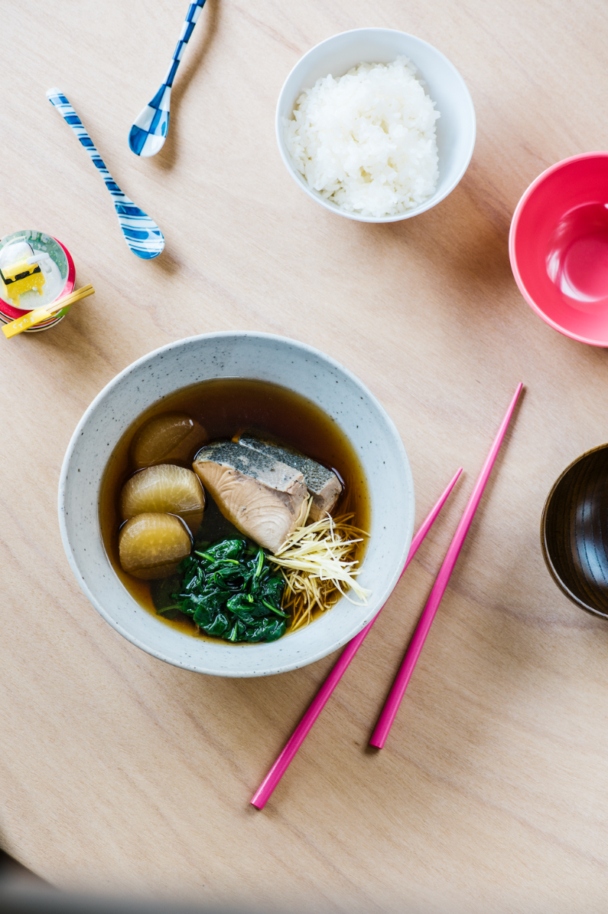

---
tags:
  - protein:fish
  - cuisine:japanese
  - ingredient:radish
  - dish:main
---
# Buri Daikon

- Serves: 4
{ #serves }
- Date added: 2023-08-27

## Description

A warming fish stew, buri daikon is a home-cooked dish with a nostalgic flavour. It is typically found in Japan in winter, when the kingfish is fatty and rich in flavour and daikon (Japanese radish) comes into season. The addition of ginger, along with the blanching process, removes the fishy scent and flavour from the kingfish.

## Ingredients { #ingredients }

- 1 large daikon, peeled and cut crosswise into .75-inch-thick slices
- 1 handful uncooked rice
- 4 (6-ounce) kingfish fillets
- 1 quart Konbu dashi
- .75 cup sake
- 1 (1.5-inch) piece ginger, peeled and cut into very thin strips
- 3 tablespoons soy sauce
- 1 tablespoon granulated sugar
- 2 tablespoons mirin
- 1 teaspoon salt
- 1 cup packed spinach leaves
- Cooked rice, for serving

## Directions

1. Place the daikon and uncooked rice in a large saucepan and cover with water. Bring to the boil over medium heat and cook until a knife easily pierces all the way through the daikon, about 20 minutes. Drain the daikon and discard the liquid and rice. (This step removes the bitterness from the daikon.)
2. Fill a large bowl with iced water. Fill a medium saucepan with water; bring to a boil over high heat. Blanch the kingfish fillets in the boiling water until they turn opaque. Drain the kingfish, then transfer it to the iced water to refresh. Drain again and dry thoroughly with paper towels.
3. In a large saucepan over medium heat, bring the konbu dashi, sake, and ginger to a simmer, then add the kingfish, daikon, soy sauce, sugar, mirin, and salt. Cut out a circle of parchment paper the same size as the mouth of the saucepan and place on top of the liquid; this will prevent it from evaporating too quickly. Reduce the heat to low and cook for 15 minutes.
4. Keeping the saucepan on the heat, use a slotted spoon to transfer the daikon and kingfish four serving bowls, dividing them evenly between the bowls. Blanch the spinach in the hot cooking liquid just until wilted, then add it to the bowls. Ladle some of the cooking liquid on top. Serve warm with rice.

## Source

[Dill Magazine](https://digital.dillmagazine.com/buri-daikon/) (paywalled), adapted from Tokyo Local: Cult Recipes from the Streets That Make the City by Caryn Liew and Brendan Liew.

## Comments

