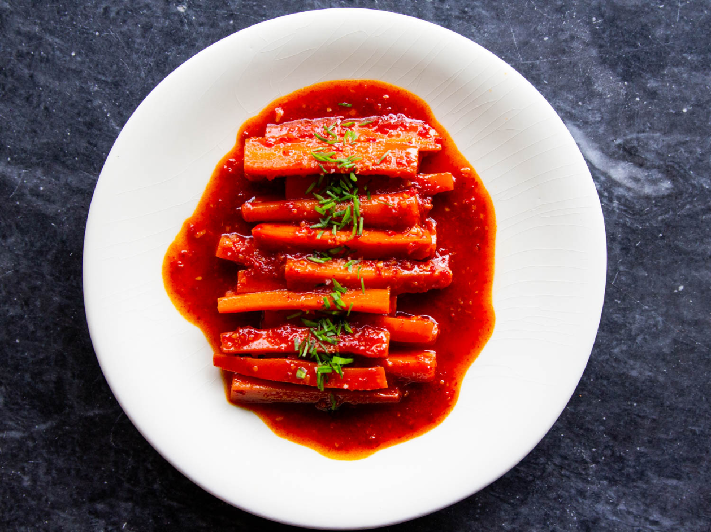

---
tags:
  - sides
---
# Burnt Honey and Gochugaru-Glazed Carrots

- Serves: 2
{ #serves }
- Time: 15 minutes
- Date added: 2023-08-27

## Ingredients { #ingredients }

- 2 tablespoons (30ml) honey
- 12 ounces (340g) carrots, peeled and cut into 2.5-inch-long by .5-inch-thick batons (about 6 small carrots)
- 1 one-inch piece fresh ginger, peeled and minced (about 2 teaspoons; 12g)
- 2 medium garlic cloves (10g), minced
- 2 tablespoons (14g) coarse ground gochugaru (Korean chili flakes)
- 1 cup (240ml) homemade chicken or vegetable stock, or store-bought low-sodium stock, plus extra as needed
- 2 tablespoons (28g) unsalted butter
- 2 teaspoons (10ml) soy sauce
- 1 teaspoon (5ml) fish sauce
- 1 teaspoon (5ml) unseasoned rice wine vinegar
- 1 teaspoon (5ml) toasted sesame oil
- Thinly sliced chives, scallions, or garlic chives, for garnish

## Directions

1. In a 3-quart saucier or saucepan, add honey and cook over medium-high heat, stirring constantly with a rubber spatula, until honey darkens and takes on the color of molasses, 2 to 3 minutes.
2. Add carrots, ginger, garlic, and gochugaru, season lightly with salt, and continue to cook, stirring constantly, until mixture is very aromatic, about 30 seconds. Add stock, butter, soy sauce, and fish sauce, stir to combine, and bring to a boil. Cover saucepan with lid or round of parchment paper, and adjust heat as necessary to maintain rapid boil. Cook, stirring and swirling saucepan occasionally, until carrots are tender and give very little resistance when poked with a cake tester or paring knife, 7 to 9 minutes. If liquid drops to below .5-inch during cooking, top up with additional stock or water.
3. Remove lid and continue to cook carrots at a rapid simmer, stirring and swirling constantly, until sauce is reduced to a syrupy glaze, about 1 minute. If at any point the glaze over-reduces and the emulsion breaks (a visual indicator of this is fat separating and making the liquid look greasy), add water or stock, 1 tablespoon (15ml) at a time, stirring and swirling constantly, until emulsion is stabilized once more. Remove from heat, stir in rice wine vinegar and sesame oil, and season with salt to taste. Divide between small individual serving dishes, sprinkle with chives or scallions, and serve.

## Source

[Serious Eats](https://www.seriouseats.com/recipes/2020/06/glazed-carrots-with-burnt-honey-and-gochugaru.html)

## Comments

