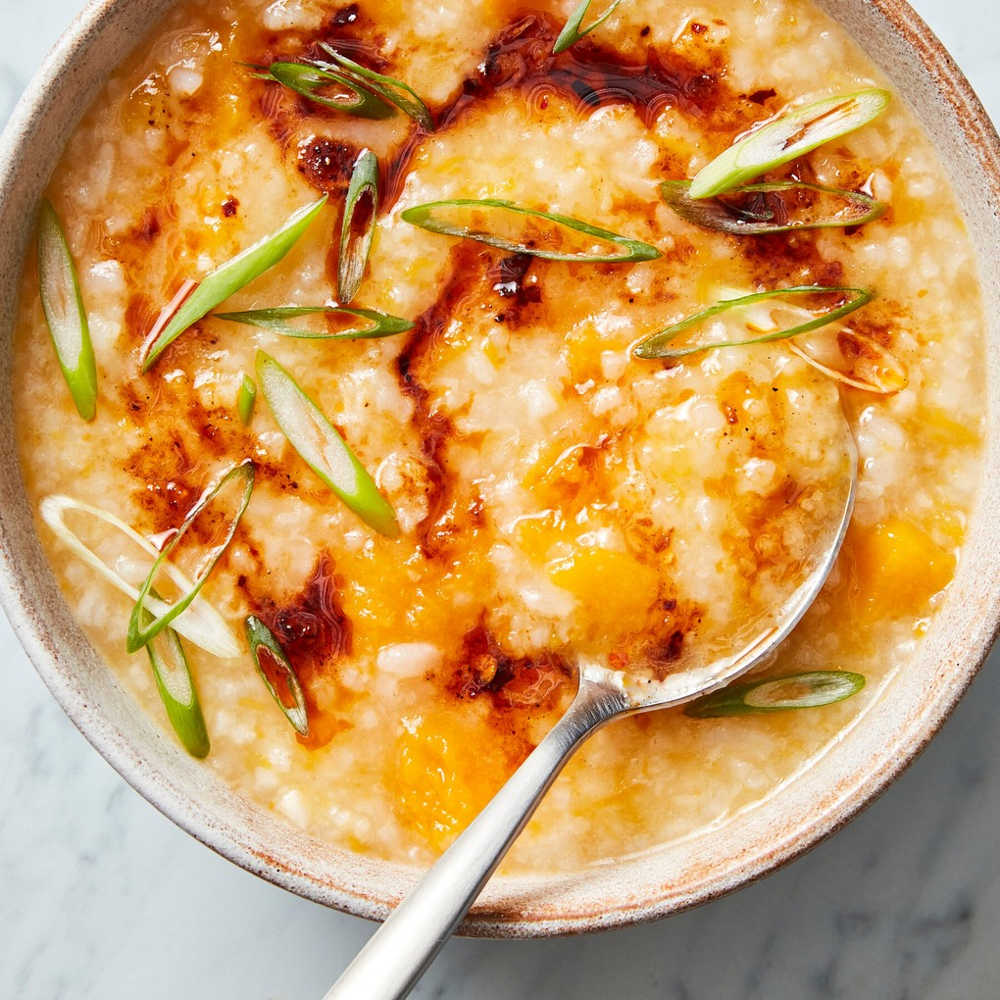

---
tags:
 - dish:main
 - ingredient:butternut squash
 - ingredient:rice
 - difficulty:easy
---

# Butternut Squash Congee With Chile Oil

- Serves: 4 
{ #serves }
- Time: 45 minutes
- Date added: 2024-03-21

## Description

This particular version of congee is not traditional to any region or cuisine, but is a seasonal interpretation, incorporating butternut squash for a warming, naturally sweet, earthy glow. The chile oil delivers a lively counter to the mellow nature of this congee, delivering both heat and savoriness.

## Ingredients { #ingredients }

- 2 tightly packed cups leftover medium- or long-grain rice (preferably refrigerated)
- 1 tablespoon Neutral oil (such as canola)
- 1 teaspoon kosher salt (such Diamond Crystal)
- 6 cups vegetable stock 
- 4 garlic cloves (peeled and crushed)
- 1 pound (about .5 small) butternut squash (peeled, seeded and diced in 1-inch pieces)
- 1 small piece kombu (optional)
- 2 scallions (finely sliced)
- Chile oil or chile crisp (for serving)

## Directions

1. Place the rice, oil and salt in a large pot and stir to combine, breaking up any clumps of rice. Add the vegetable stock, garlic, butternut squash and kombu (if using). Bring to a boil over medium-high heat. Once it boils, reduce heat to low, cover and simmer for 30 minutes.  
2. Uncover and stir. Increase heat to medium and simmer for another 5 to 10 minutes, until the rice has broken down.  
3. Turn off heat and discard any larger pieces of seaweed, though it is fine to leave them in. Using a wooden spoon, stir vigorously to break up the rice, butternut and garlic. Some of the butternut will stay intact, while some of it will break apart and impart a beautiful golden hue to the dish. Add salt to taste.  
4. To serve, top with scallions, and a few drops of chile oil or crisp.

## Notes

Using leftover rice gives you a hearty congee in just about 30 minutes, but make sure you give it a good stir at the end to further break up the rice and create a creamy finish. Butternut can be an unwieldy vegetable and many find it hard to handle, so try cutting it into smaller pieces before slicing the skin off with a sharp knife or peeler. Quicker still, opt for pre-cut cubes of butternut which can often be found at the supermarket.

## Source

[NYTimes](https://cooking.nytimes.com/recipes/1023629-butternut-squash-congee-with-chile-oil)

## Comments
