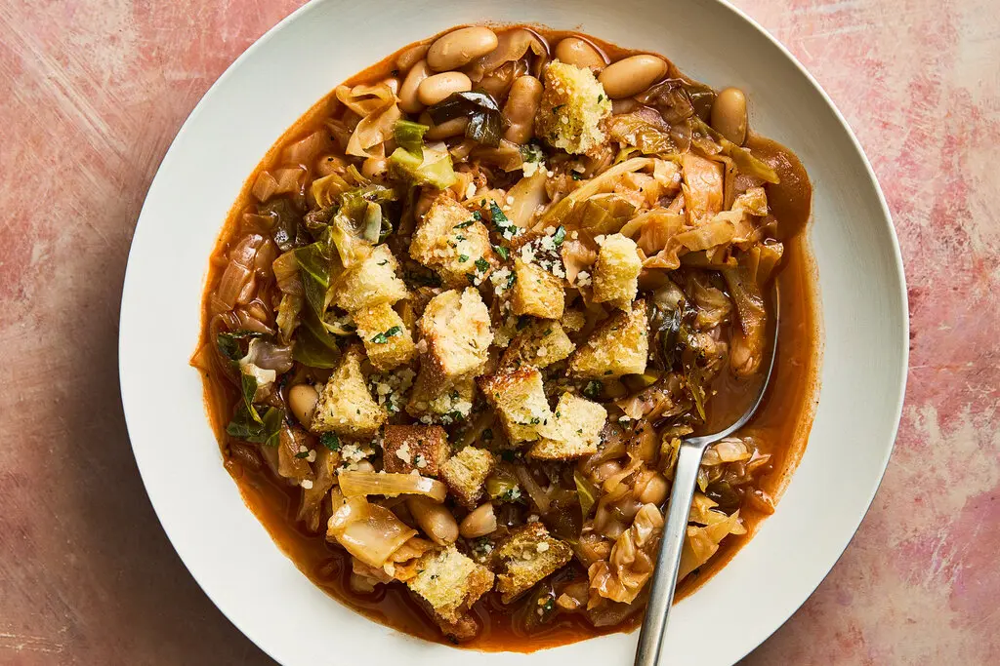

---
tags:
  - dish:main
  - protein:beans
  - ingredient:cabbage
---
<!-- Tags can have colon, but no space around it -->

# Caramelized Cabbage and Onion Soup With Cheesy Croutons

<!-- Serves has to be a single number, no dashes, but text is allowed after the
number (e.g., 24 cookies) -->
- Serves: 6
{ #serves }
<!-- Time is not parsed, so anything can be input here, and additional
values can be added (e.g., "active time", "cooking time", etc) -->
- Time: 70 min
- Date added: 2026-02-18

## Description
This rich and hearty, pantry-leaning vegetarian soup is built on layers of flavor: Sweet caramelized cabbage and onions provide the base, complemented by the subtle acidity of tomato paste and wine. The liquid from canned cannellini beans adds texture and body, while a Parmesan rind in the simmering broth contributes savory, nutty complexity. Fresh garlic, added at the end, provides a vibrant kick that brightens this satisfying soup.

## Ingredients { #ingredients }

<!-- Decimals are allowed, fractions are not. For ranges, use only a single dash
and no spaces between the numbers. -->
- 8 tablespoons unsalted butter, divided
- 1 small head green cabbage (about 2 pounds), cored and thinly sliced into ½-inch strips
- 1 medium yellow onion (about 8 ounces), halved and sliced ¼-inch thick
- Kosher salt and freshly ground black pepper 
- 1 tablespoon tomato paste 
- .5 cup dry white wine
- 2 (14-ounce) cans white cannellini beans 
- 1 Parmesan rind (about 4 inches)
- 2 tablespoons soy sauce
- 2 garlic cloves, divided 
- 3 thin slices sourdough or country bread, cut into ½-inch cubes 
- 2 tablespoons finely chopped parsley
- .25 cup grated Parmesan 

## Directions

<!-- If you have a direction that refers to a number of some ingredient, wrap
the number in asterisks and add `{.ingredient-num}` afterwards. For example,
write `Add 2 Tbsp oil to pan` as `Add *2*{.ingredient-num} to pan`. This allows
us to properly change the number when changing the serves value. -->
1. Melt 4 tablespoons butter in a large Dutch oven (or other heavy pot) over medium-high heat. Once the butter is foamy, add half of the cabbage and onions, season with salt, and cook, stirring occasionally, until wilted and reduced in volume, 3 to 4 minutes. Add the remaining cabbage and onions and cook for another 3 to 4 minutes, then reduce the heat to medium and cook, stirring occasionally, until the cabbage mixture is very soft and browned, about 25 minutes.
2. Add the tomato paste and cook, stirring frequently, until it turns dark and rust-colored, about 3 minutes. Add the wine and cook for another 1 minute.
3. Add the beans and their liquid, plus the Parmesan rind and 6 cups water. Bring the mixture to a boil and then reduce the heat to medium-low and simmer until the flavors deepen, 15 to 20 minutes.
4. Turn off the heat, stir in the soy sauce and grate in 1 clove of garlic. Season with salt and pepper to taste.
5. While the soup is simmering, melt the remaining 4 tablespoons butter in a medium skillet over medium heat. Add the bread cubes and toast, tossing frequently until the bread cubes are golden brown and crunchy, 5 to 6 minutes.
6. Transfer the toasted bread to a medium bowl, add the parsley and cheese, grate in the remaining clove of garlic, season with salt and pepper and toss to coat.
7. Serve the soup with the croutons on top.

## Source

[NYTimes](https://cooking.nytimes.com/recipes/764880625-caramelized-cabbage-and-onion-soup-with-cheesy-croutons)

## Comments

- 2026-02-18: delicious. with leftovers, drained the broth (for Nora to eat separate) and chopped up the solids, then tossed with farfalle. worked well
